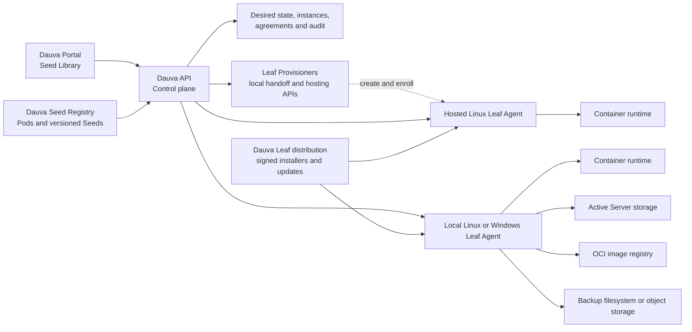

# Dauva native server platform

Status: **Phase 5 complete; Phase 6 Leaf delivery implemented and end-to-end acceptance in progress**

Last updated: 2026-07-29

This document is the canonical product and architecture design for Dauva's
native game-server platform. Keep it current when the Seed format, registry,
Leaf Agent, storage model, or migration plan changes. Important implementation
decisions that outlive this design should also receive a short ADR.

If this document moves to a future Dauva umbrella repository, leave a link here
to the new canonical location instead of maintaining two copies.

## Summary

Dauva owns the full product model and control plane for creating and managing
Servers. Pterodactyl is no longer a runtime dependency. Existing trusted
Compose Servers remain controllable through the Leaf while they are adopted or
recreated from native Seeds.

The platform has two separate distribution concerns:

1. The **Dauva Seed Registry** stores small, versioned Pod and Seed manifests.
2. An **OCI image registry** stores the container images referenced by Seeds.

Large game installations, saves, mods, and backups do not belong in the Seed
Registry. Active data lives on the selected Leaf; backups live on separate
backup or object storage.

## Goals

- Create, start, stop, restart, inspect, update, back up, restore, and safely
  delete Servers without depending on Pterodactyl.
- Make every installable Server type a curated, versioned, reproducible Seed.
- Keep the portal and public API provider-neutral.
- Support one Debian Leaf first and multiple Leaves later.
- Allocate ports, storage, CPU, and memory safely and predictably.
- Record required license and EULA acceptance server-side.
- Preserve existing Servers while the native Branch is introduced.
- Keep provider-specific credentials and runtime details outside the client.
- Let a non-technical administrator add a supported Server without needing to
  understand Docker, ports, images, storage paths, Seeds, Branches, or Leaves.
- Let a non-technical Windows user install, pair, update, repair, and uninstall
  a Leaf without a README, archive extraction, shell, command, manually copied
  pairing code, separately installed container runtime, or port forwarding.

## Non-technical product contract

Adding a Server is a guided product flow, not an infrastructure form. The
default path is:

**Choose game → choose recommended variant → name Server → choose simple
gameplay options → accept linked agreements → Sprout**

The Seed provides safe defaults for placement, ports, storage, CPU, memory,
images, protocols, health checks, updates, and backups. Dauva selects a
compatible Leaf automatically. Technical configuration may exist behind an
explicit advanced section, but it must never be required for a supported,
proofed Seed.

The portal implements this contract as a four-step Sprout Wizard: choose a
game, name and configure it, accept any required agreements, and review before
Sprouting. Each Pod declares a recommended Seed for this default path. Other
Seeds, resource controls, game-specific overrides, and autostart remain
available as optional choices rather than mandatory infrastructure decisions.

Every Server-creation and lifecycle feature must meet these rules:

- use player-facing language and explain unfamiliar Dauva terms in context;
- recommend one Seed and one resource preset instead of requiring comparison;
- ask only questions whose answers cannot be derived safely;
- show required disk space, memory, agreements, and likely installation time
  in ordinary language before Sprouting;
- link each license, terms document, or EULA next to its required checkbox and
  record acceptance server-side;
- show visible installation progress and a useful next action when a step
  fails;
- clean up or safely resume partial work after a failed Sprouting operation;
- hide ports, container images, mount paths, environment variables, protocols,
  and Leaf placement from the default flow;
- reserve typed confirmation for destructive actions such as permanent Server
  deletion, not ordinary creation;
- provide a human-readable summary before confirmation and a clear success
  screen with connection details afterward.

A supported Seed is not product-complete if an administrator must consult
external setup instructions, edit a file, select a port, or understand the
underlying container runtime to create its Server. Acceptance testing for every
new Pod or Seed must therefore include the complete default flow from the
perspective of a first-time, non-technical administrator.

## Initial non-goals

- Running arbitrary administrator-supplied container images.
- Reimplementing Kubernetes.
- A public community marketplace in the first release.
- Live migration or automatic high availability between Leaves.
- Building a full browser file manager or SFTP replacement before native
  provisioning is reliable.
- Converting Pterodactyl Eggs into trusted Seeds automatically.

## Product language

Dauva's canonical non-technical flow is:

> Kies in de Garden een Seed uit een Pod en Sprout daarmee een Server. Dauva
> kiest automatisch een geschikte Leaf waarop die Server draait.

This sentence defines the user-facing hierarchy and must remain the basis for
Portal copy, onboarding, documentation, and future lifecycle features. Branch
is an internal execution concept and must not be presented as a game. Sprouting
happens in the Garden; Leaf placement is a technical decision that Dauva makes
automatically by default. Advanced administrators may select a Leaf explicitly
when placement control is relevant.

| Term | Meaning |
| --- | --- |
| Garden | One complete Dauva-managed environment containing its Seed Library, Leaves, Servers, policies, and operations. |
| Seed Library | The catalog administrators see in Dauva. |
| Seed Registry | The versioned technical source behind the Seed Library. |
| Pod | One game family containing related Server variants, such as Minecraft. |
| Seed | A complete, approved, reproducible recipe for one Server type. |
| Server | One installed runtime instance with its own data and settings. |
| Sprouting | Provisioning a Server from a Seed. |
| Branch | A replaceable runtime provider used by the Dauva control plane. |
| Leaf | A machine that can host Servers. |
| Leaf Agent | The restricted Dauva service that manages runtime resources on a Leaf. |
| Leaf Provisioner | An internal provider-neutral adapter that obtains and enrolls a local or hosted Leaf; normally hidden behind a simple hosting choice. |
| Withered | A failed Sprouting operation or inactive runtime condition, made explicit by accompanying text. |

A Pod is catalog metadata, not a running workload or genre. Genres are Seed
labels used for discovery and filtering. A Seed produces a Server.
A Server can contain multiple runtime components, such as a primary game
container and a backup sidecar.

## What is and is not a Seed

The current Pterodactyl-backed catalog contains candidate profiles derived from
Eggs. Those profiles are not native Dauva Seeds while their installation
behavior still depends on an Egg.

Likewise, a running Server is not copied wholesale into the registry. Its
sanitized and repeatable recipe becomes a Seed.

Seed material includes:

- exact container images;
- runtime components and their relationship;
- ports and protocols;
- persistent volume roles;
- supported inputs and secrets;
- resource requirements and presets;
- agreements;
- health and readiness checks;
- graceful stop behavior;
- update and backup capabilities.

Instance data never becomes Seed material:

- worlds and saves;
- passwords, tokens, and private keys;
- player lists and administrator assignments;
- installed user mods;
- logs;
- generated identifiers;
- actual backups.

## Current baseline

The Debian host was inspected read-only on 2026-07-24.

The current real game Servers are:

- Minecraft, with a separate backup sidecar;
- Valheim;
- Core Keeper;
- Satisfactory;
- Factorio;
- Enshrouded, intentionally stopped at the time of inspection.

These Servers run directly through Docker Compose. Pterodactyl Panel and Wings
are active, but Wings had zero game-server containers and zero server volume
directories at the time of inspection. No live game-server migration out of
Pterodactyl is therefore required before native development starts.

The existing API already provides useful foundations:

- provider-neutral public routes and models;
- `IGameServerProvider` as a replaceable runtime boundary;
- managed instance persistence and reconciliation;
- status and power actions;
- autostart behavior;
- safe deletion;
- a Docker client used for existing Compose-managed Servers.

The API now persists the selected resource preset, resolved non-secret options,
Seed version, Seed manifest digest, and compiled registry digest for every
native Server. Agreement acceptance is stored in a separate audit record with
the Server, Seed, agreement, accepting user, URL, revision, and timestamp.

Seed v1 is implemented as JSON Schema plus stricter policy validation. The
registry contains nine game-family Pods and eighteen sanitized Seeds: two
meaningful variants per Pod. Factorio Stable, Valheim BepInEx, both
Satisfactory branches, and both Enshrouded runtimes passed fresh native
lifecycle proofs and joined the original stable Seeds. Minecraft Paper then
passed its EULA-gated Paper 26.2 lifecycle proof with persistent world data,
ordered restart, and native RCON backups. All twelve original Seeds are stable.
Terraria, Project Zomboid, and Garry's Mod add six stable Seeds. All six passed
fresh disposable lifecycle proofs on the Debian Leaf; their exact
release-candidate versions, manifest digests, agreement revisions, checks, and
proof expiry are retained in committed receipts.

The separately deployable Leaf Agent now owns every privileged host operation.
The API has no Docker socket and Pterodactyl is removed. Newly Sprouted Servers
always use a compatible healthy Leaf. Existing trusted Compose Servers remain
discoverable and controllable through a restricted legacy Leaf contract; they
are never adopted, restarted, moved, or deleted automatically.

## Target architecture



### Dauva Portal

The portal renders the Seed Library, configuration forms, agreements, progress,
runtime status, and safe lifecycle actions. It never receives provider
credentials or direct Docker access.

### Dauva API

The API is the authoritative control plane. It:

- resolves an exact Seed version and digest;
- validates options and agreements;
- selects a compatible Leaf by capabilities, memory, storage, and free ports;
- persists desired state before provisioning;
- sends idempotent commands to the Branch;
- reconciles desired and observed state;
- stores audit and failure details;
- serves a provider-neutral response to clients.

### Dauva Seed Registry

The initial registry should be Git-backed and compiled by CI into a validated,
immutable index. A database-backed registry service is unnecessary for the
first release.

The API caches the last known valid registry revision. A broken or unreachable
new revision must not remove already installed Seeds or prevent existing
Servers from being managed.

The registry can later be distributed as signed OCI artifacts and support
multiple trusted sources. The Seed Library remains the user-facing name.

The control plane exposes read-only administrator routes for the compiled
Registry, individual Pods, and individual Seeds. Registry mutation remains a
reviewed Git workflow: a portal request cannot silently rewrite trusted Seed
material.

Every Seed records:

- its upstream delivery kind (`oci`, `steamcmd`, `linuxgsm`, or `dauva`);
- official homepage and reviewed source repository;
- permitted image registries and upstream application identifier;
- trust level and review date;
- storage estimates and backup expectation;
- update discovery policy;
- required Leaf capabilities;
- proof policy and current compiled proof summary.

OCI, SteamCMD, and LinuxGSM source adapters normalize upstream metadata into a
draft Seed. They do not bypass curation, digest pinning, agreement review, or
proof promotion.

### Dauva Leaf Agent

The Leaf Agent owns privileged host operations:

- pulling approved images;
- creating networks, containers, and volumes;
- allocating and reserving ports;
- applying CPU and memory limits;
- starting, stopping, and inspecting components;
- collecting logs and health state;
- invoking backup, restore, and update operations;
- deleting runtime resources only after an authorized control-plane command;
- reporting capacity and observed state.

The API container does not receive the Docker socket or active Server storage.
All runtime discovery and mutation, including control of trusted legacy
Compose Servers, crosses the authenticated Leaf contract.

The first extracted Agent uses a control-plane-initiated private HTTP
connection with a unique 256-bit-or-stronger bearer credential. The Agent:

- exposes no unauthenticated management route;
- verifies its Leaf ID, Registry digest, Seed version, and Seed manifest digest;
- advertises the restricted capabilities it implements;
- accepts only declarative commands compiled from a trusted Seed;
- owns the Docker socket and approved storage roots so the API no longer needs
  new direct runtime privileges;
- returns provider-neutral lifecycle results;
- can run a disposable proof without adding a permanent Server record.

### Lifecycle operations

The control plane provides one Server lifecycle model:

- a dedicated, deep-linkable Server care page with status, power controls,
  Leaf capacity, logs, backups, schedules, Seed changes, and console access;
- component-aware logs with bounded tail sizes;
- console commands only through a Seed-declared protocol, private RCON port,
  and generated or administrator-owned secret—never a host shell;
- consistent persistent-volume backups, retention, restore, and exact-target
  deletion;
- transactional restore staging so a failed restore keeps the previous data;
- Seed updates and trusted-history rollback, each preceded by a safety backup;
- daily or weekly schedules evaluated in `Europe/Amsterdam`;
- Leaf capacity and health reporting;
- read-only migration discovery for native workloads and trusted legacy
  candidates.

Backups are stored outside the active Server tree through the
`ILeafBackupStorage` contract. The first adapter uses a filesystem root; a
future NAS or object-storage adapter can replace it without changing
stop/archive/retention/restore/rollback behavior. A Leaf reports the adapter's
readiness and whether its target is disaster-safe. Local backups are useful
for operator mistakes but are explicitly shown as not disaster-safe.

At the 2026-07-27 production review, the active `/mnt/data` filesystem had
about 215 GB free. No separate physical filesystem had more than 200 GB free:
the media disks had about 158 GB and 160 GB individually, and the merger pool
is not suitable for game-server recovery data. The initial filesystem adapter
therefore remains on `/mnt/data/dauva-backups`, outside active Server
directories but on the same data SSD, with three retained archives per
Server. Dauva labels these as local restore points until a separate disk, NAS,
or object-storage adapter is configured.

### Multi-Leaf placement

Retained infrastructure-managed Leaves may still be configured through
`PORTAL_LEAVES_JSON`. New Leaves use the portal-owned enrollment flow:

1. An administrator names the Leaf and requests a pairing code.
2. Dauva stores only a SHA-256 digest of the random, 20-minute, single-use code.
3. The unpaired Agent exposes a small local setup page and no management API.
4. The Agent claims the code with the private address the control plane should
   use.
5. Dauva issues a unique 256-bit bearer credential, stores only an ASP.NET
   Data Protection-encrypted copy, and marks the code as claimed.
6. The Agent writes its immutable Leaf ID and token atomically to an
   owner-readable enrollment file and restarts into paired mode.

Public advertised addresses require HTTPS. Plain HTTP is accepted only for
loopback, private, link-local, internal DNS, or Tailscale CGNAT addresses.
This preserves private-network deployments without turning pairing into an
SSRF primitive.

Portal-managed and configuration-managed Leaves are merged behind one endpoint
source. A static configuration wins if IDs ever conflict. The API rejects
unexpected Leaf identities and Registry digests. Sprouting selects only an
enabled healthy Leaf that advertises every required capability and has
sufficient memory, disk headroom, and port capacity. Existing Server IDs retain
their Leaf identity, so fleet changes cannot silently move a Server.

An administrator can rename a portal-managed Leaf or pause it for new Sprouts.
Pausing does not destroy existing Servers or their ability to receive lifecycle
commands. Removing a Leaf revokes the stored credential and is refused while
any managed Server still references that Leaf. Configuration-managed Leaves
remain read-only in the portal.

### Local and externally hosted Leaves

Local and external hosting share one Server model. A Seed declares required
capabilities, resources, ports, storage, and agreements; it never embeds a
hosting-company plan, region, account, host path, or provider credential. Once
enrolled, every machine is an ordinary Leaf and participates in the same
capacity reporting, placement, lifecycle, update, backup, restore, scheduling,
and safe-removal contracts.

The default Sprout flow may offer three hosting intentions without exposing
infrastructure terminology:

1. **Automatic (recommended):** reuse the best compatible healthy Leaf or,
   when the administrator has enabled paid hosting, offer an exact hosted plan
   when no suitable capacity exists.
2. **My own device:** use an existing local Leaf or guide the administrator
   through the signed one-click Windows or Linux installation flow.
3. **Dauva Hosting:** provision and enroll a suitable external Leaf through a
   configured hosting provider. An advanced administrator may later connect
   their own supported cloud account through the same boundary.

Automatic placement never creates billable infrastructure silently. Dauva
must show the region, recurring price, included resources, storage, and
provider before the administrator authorizes the first paid Leaf or a resize.
After that authorization, the ordinary Server flow remains provider-neutral.

The control plane owns an `ILeafProvisioner`-style contract separate from the
Branch contract. A Leaf Provisioner can:

- list supported regions, plans, capabilities, availability, and exact quotes;
- create, inspect, resize, stop, start, and explicitly delete compute;
- attach suitable persistent storage and configure the required network edge;
- bootstrap a checksum-verified Leaf Agent through the provider's protected
  initialization channel;
- exchange the one-time bootstrap claim for normal outbound-TLS Leaf
  enrollment without exposing SSH or a copied pairing code;
- tag every resource with immutable Garden and Leaf ownership identifiers;
- reconcile provider state and report actionable failures without leaking
  provider-specific responses into the Server API.

The local provisioner does not create infrastructure. It creates the pending
Leaf handoff consumed by the signed installer and considers provisioning
complete only after the authenticated Agent heartbeat proves readiness. The
first external provisioner should create a Linux Leaf because the Agent can run
the container Branch natively there. The provider owns its physical hardware,
power, network, and hypervisor; Dauva owns Agent installation and everything
above it. Managed Hyper-V remains only the Windows Leaf runtime implementation
and is never an external-hosting or Seed requirement.

Deleting a Server deletes only that Server. It never cancels or deletes its
Leaf. Deleting a provider-managed Leaf is a separate typed-confirmation action,
is refused while Servers still reference the Leaf, and checks backup policy
before removing provider storage. Idle-host shutdown or deletion may later be
policy-driven, but paid-resource consequences must stay visible.

Portable backup and transactional restore provide the supported move path
between local and hosted Leaves. Dauva can restore a Server onto another
compatible Leaf, verify readiness, switch its desired placement, and only then
remove the old instance. Live migration and automatic high availability remain
separate later features.

Every external provider receives its own disposable acceptance lane. That lane
must prove create, Agent bootstrap, enrollment, Sprout, restart, backup,
restore, Server delete, Leaf delete, orphan cleanup, quota failure, and
idempotent retry. The clean Windows VM lane independently proves the local
one-click Windows path; neither acceptance environment changes the
provider-neutral user experience.

### One-click Windows Leaf installation

Windows installation is a product flow, not an operator deployment guide. Its
implementation belongs in the dedicated private `Deucarian/dauva-leaf`
repository and the Dauva infrastructure/distribution layer. The Garden
integration consumes the resulting installer and handoff contracts in its
separate develop-only UI stream; this phase does not redesign or directly
change that UI.

The supported path starts from a pending Leaf created in Dauva and ends only
when Dauva observes that Leaf as ready:

1. The administrator chooses the Windows installation action for the pending
   Leaf and downloads a generic Authenticode-signed
   `DauvaLeafSetup.exe`.
2. The user starts the installer and accepts the unavoidable Windows UAC
   prompt. A browser security prompt or a Windows reboot is acceptable when
   the operating system requires it; instructions, commands, prerequisites,
   and copied codes are not.
3. The bootstrapper installs a self-contained Dauva Leaf Windows Service,
   updater, local maintenance entry, managed runtime, and only the required
   firewall or loopback registrations. It resumes automatically after a
   required reboot.
4. The Service generates an ephemeral PKCE verifier in memory and creates an
   installation session over outbound TLS. The installer opens the
   authenticated Dauva handoff in the system browser using only a public,
   non-authorizing correlation ID. The current Dauva session binds the
   installation session to the pending Leaf. If several pending Leaves exist,
   the user selects one by its friendly name; no code is shown or copied.
5. The Service polls the additive handoff boundary using proof of its
   in-memory verifier. The control plane delivers the single-use enrollment
   result only to that proven Service session. The Service stores its immutable
   identity and credential with machine-level protection and starts normal
   Agent operation.
6. The installer waits for service health, compatible Registry digest,
   runtime readiness, capacity reporting, authenticated control-plane
   reachability, and Dauva's observed-ready state. It then returns the browser
   to that Leaf in Dauva.

The raw pairing code, PKCE verifier, or Leaf bearer credential must never
appear in the installer filename, download URL, process arguments, browser
history, registry, logs, crash reports, or ordinary files. Installation sessions are short-lived,
single-use, bound to the machine public key, PKCE challenge, and pending Leaf,
and safe against replay. The public browser correlation ID is not
authorization. The existing manual local setup page, headless Linux variables,
direct private HTTP transport, lifecycle payloads, and bearer authentication
remain compatible. Installer handoff and reverse transport are additive,
versioned capabilities behind the same enrollment, endpoint-source, and Branch
boundaries.

#### Windows runtime and connectivity

A Windows service alone cannot run the existing Linux OCI Seeds. The installer
must therefore own a headless runtime rather than silently requiring Docker
Desktop or a user-session process. The production target is now a
Dauva-managed Hyper-V Linux microVM containing the reviewed container engine.
The installer enables the required Windows feature, deploys the signed and
versioned runtime image to the selected data volume, handles a required reboot,
and proves that the VM starts before user login.

WSL 2 was rejected by the hard service-ownership gate on 2026-07-28. The same
checksum-verified runtime and pinned Seed worked under the interactive user,
but Windows returned `Wsl/WSL_E_LOCAL_SYSTEM_NOT_SUPPORTED` when the proof ran
under the actual LocalSystem service identity. LocalService and NetworkService
also failed to provide a viable unattended WSL execution identity. Dauva will
not create a password-bearing pseudo-user or depend on an interactive login to
work around that platform boundary. WSL remains useful for development, not
the Windows Leaf production runtime.

Remote Windows Leaves must not require inbound NAT, router changes, public
ports, Tailscale installation, or a permanent unauthenticated listener. The
Windows Agent establishes an outbound authenticated TLS session to Dauva over
ordinary port 443. A new `ILeafTransport` boundary routes the unchanged,
idempotent Leaf operation contracts through either:

- the existing control-plane-initiated private HTTP transport; or
- the outbound Windows session with correlation IDs, bounded payloads,
  cancellation, timeouts, and reconnect-safe operation replay.

The first outbound session may use the unique enrolled bearer credential over
TLS. The transport must remain replaceable by per-Leaf mTLS without changing
Portal, Seed, Server, or lifecycle contracts.

#### Windows service, storage, updates, and removal

The installer uses a per-machine Windows Installer package inside a signed WiX
Burn bootstrapper. The existing restricted Go Agent is a self-contained
Windows Service with automatic start and service-recovery policy. Immutable
binaries live below `%ProgramFiles%\Dauva\Leaf`; protected machine state, logs,
staged updates, and enrollment live below `%ProgramData%\Dauva\Leaf`. The
service runs as LocalSystem because it owns machine-wide Hyper-V, NAT, and
firewall resources before any user logs in. Its privileged surface remains a
small declarative runtime-manager contract plus the private host/guest socket;
it does not expose arbitrary command execution or a public management listener.

Large runtime and Server data do not default to the operating-system or user
profile directory. Setup automatically selects the eligible fixed local volume
with the most safe free space while preserving Dauva's reserve. A future
maintenance flow may expose an advanced **Change storage** action, but storage
knowledge is never required for the default installation. The managed runtime
VHD, image cache, active Server volumes, and local restore points use separate
logical roots so retention, migration, repair, and uninstall cannot confuse
them. Network, removable, BitLocker-locked, and unsupported filesystems are not
selected silently.

The distribution layer publishes immutable stable and candidate channels with
version, compatibility range, source commit, length, SHA-256, signer identity,
release notes, and rollback metadata. The bootstrapper, MSI, service, updater,
runtime payload, and channel manifest are signed. The updater stages downloads,
verifies both the manifest and Authenticode chain, waits for active operations
to drain, replaces binaries atomically, restarts the service, and rolls back
when the new version cannot become healthy. An update cannot silently cross an
incompatible Leaf protocol or runtime-storage migration boundary.

Windows **Installed apps** provides change, repair, update, and uninstall.
Uninstall stops and removes the service, updater, protocol/loopback
registration, and installer-owned runtime only after it is safe. It revokes
the Leaf credential when the control plane is reachable. If managed Servers
remain, destructive runtime removal is blocked and the maintenance flow opens
that Leaf in Dauva so the Servers can be moved or deleted. Server data and
backups are retained by default; deleting them remains a separate,
name-confirmed Dauva lifecycle action. An offline forced software removal may
leave recoverable data but must state exactly what remains.

#### Windows acceptance contract

The Windows deliverable is not complete until an automated clean-VM matrix
proves all of the following on supported Windows 10 and Windows 11 x64 builds:

- a machine with no Agent, Hyper-V Leaf VM, Docker Desktop, container engine,
  or development tools can complete installation through UAC and any required
  reboot without instructions or commands;
- authenticated browser handoff pairs the intended Leaf without displaying or
  copying a pairing code and rejects replay, stale authorization, wrong-user,
  and wrong-Leaf attempts;
- the service starts before login, survives reboot, reconnects outbound through
  ordinary HTTPS, and returns Dauva to an observed-ready Leaf;
- install, repair, same-version repair, upgrade, interrupted upgrade, automatic
  rollback, and uninstall pass with signed production-shaped artifacts;
- credentials and authorization material are absent from URLs, arguments,
  logs, registry values, crash output, and unprotected files;
- storage selection and free-space reserve protect the Windows system volume;
- uninstall with an active Server is non-destructive, while empty-Leaf
  uninstall revokes credentials and removes installer-owned software;
- a disposable proven Seed can Sprout, report healthy, stop, restart, preserve
  data, expose bounded logs, and delete through the additive outbound Dauva
  lifecycle contract.

### Seed releases

The Registry keeps the current stable Seed plus immutable historical releases.
Preparing a new candidate archives the previous stable manifest before it can
be replaced. Rollback accepts only a historical manifest whose ID, version, and
digest match the recorded deployment. The optional `console` contract is
validated against an existing component, private TCP RCON port, and declared
secret.

TLS termination is not required on the private Compose network. Connections
that leave a private host or overlay network must use HTTPS or mTLS. Bearer
authentication remains the private transport. Pairing now supplies unique,
revocable per-Leaf credentials without hand-editing the control-plane
environment. A later mTLS transport can replace bearer credentials behind the
same enrollment and endpoint-source boundaries.

### OCI image registry

Seeds reference images by immutable digest. Mutable tags such as `latest` and
`stable` can be shown as channels but cannot be the stored runtime identity.

Game binaries should not automatically be baked into very large images.
SteamCMD-based Seeds may use a small trusted runtime image and install game
content into persistent Leaf storage on first Sprouting. A Leaf-local download
cache can be added later.

## Seed v1 requirements

A Seed v1 manifest must be declarative and contain at least:

- `schemaVersion`;
- immutable Seed `id`;
- semantic `version`;
- `podId`;
- one or more discovery `genres`;
- localized title and description;
- supported operating systems and CPU architectures;
- one or more runtime components;
- an immutable image digest per component;
- a primary component;
- ports with protocol, purpose, exposure, and allocation rules;
- volumes with a role such as `data`, `save`, `cache`, or `backup`;
- resource minimums, maximums, and presets;
- typed configuration inputs;
- secret inputs that never receive defaults in the manifest;
- agreements with canonical URL and agreement revision;
- health and readiness checks;
- graceful stop timeout and behavior;
- update, backup, and restore capabilities;
- required restricted runtime capabilities.

Each Seed declares exactly one `podId`. A Pod groups one or more related
Server variants for the same game family, and has no arbitrary per-Pod Seed
limit. The compiled catalog derives membership from the Seeds so Pod and Seed
manifests cannot maintain conflicting lists.

Executable installation behavior belongs in reviewed, signed images. The
registry must not permit arbitrary host shell scripts, privileged containers,
host PID or network namespaces, Docker socket mounts, or unrestricted host
paths.

### Multi-component Servers

A Seed can describe a small workload rather than only one container.

The initial example is Minecraft:

- primary component: the Minecraft Server;
- companion component: the backup worker;
- shared read-only or read-write volumes as explicitly declared;
- a secret file for RCON authentication;
- companion lifecycle tied to the primary Server.

Each component receives Dauva ownership labels and the immutable Server and Seed
identities. Creating the same Server command twice must not create duplicates.

## Storage model

The implemented initial Leaf layout is:

```text
/mnt/data/dauva/
  servers/<server-id>/
    .dauva-owned.json
    volumes/
      data/
      backups/
```

The exact host paths are Agent implementation details and do not appear in
public Seed manifests. Seeds declare logical volume roles; the Agent resolves
those roles to approved storage roots.

On the first Debian Leaf this root lives on `/mnt/data`, the dedicated 1 TB
SSD-backed Docker/data filesystem, not on the 120 GB operating-system SSD or
the nearly full media disks. At the 2026-07-26 capacity review it had about
241 GB available. Container layers already live on the same filesystem through
`/var/lib/docker`, which avoids duplicating multi-gigabyte installations onto
the OS disk.

The initial placement is deliberately conservative:

| Data | Initial location | Reason |
| --- | --- | --- |
| OCI layers and runtime cache | `/var/lib/docker` on the data SSD | large, reusable, and already managed by Docker |
| active saves/config/install volumes | `/mnt/data/dauva/servers` | low-latency persistent storage with the most suitable free capacity |
| disposable proof data | `/mnt/data/dauva-proof/servers` | isolated ownership and easy verified cleanup |
| local Server backups | `/mnt/data/dauva-backups` through the filesystem adapter | first-line recovery only; separate tree, same data SSD |
| future durable backups | separate physical disk or object storage | survives loss of the runtime SSD |

The media merger pool is not used for active game data: it was above 80%
utilization and is optimized for media capacity rather than game-server
latency. A local backup stored on the data SSD is explicitly not called an
off-host or disaster-recovery backup.

Storage rules:

- active saves use persistent Leaf storage;
- disposable download caches are separately identifiable and garbage
  collectable;
- secret inputs are excluded from Seed manifests and ordinary Server records;
- the current single-Leaf implementation supplies secrets ephemerally while
  Sprouting and only to the runtime component that requires them;
- deletion distinguishes runtime cleanup from backup retention;
- updates can require a successful pre-update backup;
- backup retention and quotas are control-plane policy, not arbitrary Seed
  values;
- a future Leaf can advertise storage classes such as `fast`, `bulk`, and
  `backup`.
- the portal shows expected download, installed, and mutable size before
  Sprouting a large Seed;
- the Agent rejects a new Sprout when the approved storage root cannot retain
  the configured free-space reserve after the selected disk allocation.

## Port allocation

Seeds declare logical ports, not fixed public host ports.

Every port declaration includes:

- component;
- internal container port;
- TCP, UDP, or both;
- public or private exposure;
- purpose such as game, query, RCON, voice, or file transfer;
- whether two protocols must share the same public number;
- any environment input that receives the allocated value.

The Leaf Agent allocates ports atomically from configured pools and persists
the complete allocation before starting components. Partial allocation failure
must leave no leaked reservations.

The native Docker Branch now supports single dynamic ports and contiguous
paired allocations. Valheim proved a two-port public UDP pair, while Factorio
proved that a private administration port is not published to the host.

## Agreements and secrets

Required agreements remain unchecked in the portal and are independently
validated by the API.

For every accepted agreement, Dauva stores:

- Server and Seed identity;
- Seed version and manifest digest;
- agreement identifier, canonical URL, and revision;
- accepting user;
- timestamp;
- the explicit accepted value.

Passwords and tokens are never stored in the registry, ordinary instance
options, or Server responses. In the current single-Leaf implementation they
exist only during the Sprouting request and are supplied to the intended
runtime container as required by the game. Durable protected secret storage is
still required before updates, migration, or multi-Leaf reconciliation can
recreate a Server without asking the administrator again.

## Instance identity and persistence

Every managed Server must persist:

- Dauva Server ID;
- display name;
- Seed ID, version, and manifest digest;
- Pod ID;
- Branch and Leaf identity;
- selected resource preset and resolved limits;
- allocated ports;
- logical volume assignments;
- desired autostart mode;
- provisioning and runtime state;
- accepted agreement references;
- created-by and audit timestamps;
- last actionable error.

Installed Servers continue using their pinned Seed version until an explicit
update operation succeeds. Publishing a new Seed version never silently
changes an existing Server.

## Seed sources, updates, and proof promotion

Source discovery and runtime identity are separate:

1. A mutable upstream tag or release feed is checked on schedule.
2. A changed digest creates a reviewable patch release candidate.
3. The previous stable manifest remains untouched.
4. License links, changelog, image source, and policy changes are reviewed.
5. The candidate is Sprouted on a disposable Leaf allocation.
6. Proof verifies pinned images, health stability, all declared public ports,
   backup evidence when claimed, graceful stop, restart, persistent storage,
   and complete cleanup.
7. A passed receipt is stored with Leaf ID, time, agreement revisions, Seed
   digest, Registry digest, non-secret evidence, and receipt digest.
8. Guarded promotion changes that exact candidate to stable.

Automatic checks are allowed. Automatic installation into an existing Server
is not. Existing Servers receive an update offer and remain pinned until an
administrator explicitly requests an update. A new image digest is never
silently substituted at container start.

Proof credentials and required administrator secrets are supplied only for the
disposable request. They are neither written to the Seed nor copied into the
receipt. An upstream image with a known cleartext secret logging path is
rejected during source review even if it otherwise starts successfully.

## Lifecycle and reconciliation

Sprouting is an idempotent, observable workflow:

1. Resolve and validate the exact Seed.
2. Validate options, secrets, resources, and agreements.
3. Persist the desired Server in a pending state.
4. Select the Branch and Leaf.
5. Reserve ports and storage.
6. Pull and verify images.
7. Create all components.
8. Start components in dependency order when requested.
9. Wait for readiness.
10. Mark the Server ready or Withered with an actionable failure.

The browser request ends after step 3 with `202 Accepted`. Steps 4 through 10
run in a durable API worker and are never coupled to the portal's HTTP timeout.
The worker scans both new `pending` records and interrupted `provisioning`
records, including records whose Leaf identity was already assigned before an
API restart. The portal polls transitional Servers every four seconds and can
be closed or reloaded without cancelling the Sprout.

The user-facing **Sprout Journey** consists of real, timestamped phases:

1. accepted into the durable queue;
2. validating the pinned Seed and protected settings;
3. selecting or resuming the assigned Leaf;
4. preparing persistent storage;
5. downloading the approved images;
6. creating every component;
7. starting components in Seed order;
8. waiting for the first healthy start;
9. ready.

Leaf stores phases 4 through 9 atomically below its control-plane storage,
outside Server saves and mutable volumes. The API mirrors those phases into
the durable Server record. Neither layer derives progress from elapsed time.
The portal shows the current real step, timestamps, elapsed durations, Leaf
messages, and the exact Withered phase. Closing any UI does not erase it.

Retries reuse the same Server ID and reservations. A failure after partial
creation must either reconcile forward or clean up only resources owned by that
Server. A Leaf retry adopts an already complete runtime only when every
component, Seed version, manifest digest, and Registry digest still match.
Otherwise it removes only resources carrying the matching Dauva ownership
identity before rebuilding.

A retry increments the attempt number while retaining the same Server and Leaf
identity. It reuses a complete digest-matching runtime or safely clears only
matching Dauva-owned partial resources. If a container or network cannot be
removed, storage remains untouched and the retry Withers instead of continuing
over an uncertain runtime.

Deletion remains name-confirmed in the API. Runtime resources are removed
before the database record. Backup deletion or retention is an explicit policy
and must not be an accidental side effect.

Once the exact deletion name has been confirmed, provider cleanup and record
cleanup continue independently of the browser request lifetime. A disconnected
portal must not leave a stopped container, Server record, or owned storage
behind after a confirmed deletion.

## Security invariants

- The portal never talks directly to a Leaf runtime.
- Registry inputs are untrusted until schema, policy, signature, and digest
  validation succeeds.
- Images are pinned by digest and come from allowed registries.
- Seeds cannot request privileged mode or arbitrary host mounts.
- The Agent accepts only authenticated, authorized, idempotent commands.
- Agent credentials are unique per Leaf and revocable.
- Secrets are not written to logs, manifests, labels, or command responses.
- Resource limits and storage quotas are enforced on the Leaf.
- Ownership labels prevent Dauva from mutating unrelated containers.
- Destructive operations are auditable.

## Runtime capabilities now owned by Dauva

The Leaf fleet and control plane now provide:

- container and image lifecycle;
- installation behavior;
- port allocation;
- volume creation;
- CPU and memory enforcement;
- runtime state and power actions;
- live console and logs;
- backups and restore;
- scheduled tasks;
- reinstall and update flows;
- node capacity and placement;
- multi-node communication.

Dauva also owns the product-facing catalog, agreements, authentication,
protected instance options, deployment history, high-level status, autostart,
and safe deletion. Browser file management, signed Registry distribution, and
an object-storage backup adapter remain later additions; none is required for
the lifecycle in this release.

## Delivery plan

### Phase 0: contract and registry — complete

- Define and validate Seed v1.
- Convert the six real Compose Servers into draft manifests.
- Treat the existing Pterodactyl-derived profiles as candidates, not native
  Seeds.
- Add Seed version and digest persistence.
- Add complete agreement audit persistence.
- Compile a deterministic Seed Library index in CI.

### Phase 1: Minecraft vertical slice — complete

- Create a native Minecraft Fabric Seed from the proven live configuration.
- Include the backup companion component.
- Pin all images by digest.
- Support one TCP allocation, persistent data, RCON secret handling, EULA,
  resources, health, start, stop, restart, and delete.
- Sprout a disposable test Server without touching the existing Minecraft
  Server.

Acceptance criteria:

- no Pterodactyl API or Egg was involved;
- the API and Docker resources retain a stable Dauva Server identity;
- an API restart preserved control and state;
- failed availability and stopped-health states were actionable and covered by
  regression tests;
- create, healthy status, stop, start, restart, and name-confirmed delete all
  succeeded through the live portal;
- deleting the test Server removed its two containers, private network, owned
  storage, instance record, and agreement audit record;
- the existing Minecraft Server and the other five existing game Servers
  remained uninterrupted.

The acceptance Server used an automatically allocated port in the configured
native pool and was removed after the test. Candidate Seeds were enabled only
for the acceptance window and disabled again after promotion of Minecraft
Fabric `1.0.0` to stable.

### Phase 2: current Server set — complete

Converted, validated, and lifecycle-proven:

1. Valheim;
2. Core Keeper;
3. Factorio;
4. Satisfactory;
5. Enshrouded.

This phase has added dynamic UDP and contiguous paired-port allocation,
UID/GID-aware volume ownership, ephemeral secret handoff, graceful shutdown,
Seed-specific Unix stop signals, crash-only automatic restarts, and larger
owned storage behavior. Heavy proofs ran serially to stay within the current
Leaf's memory capacity.

Live acceptance evidence:

- Factorio completed create, running status, stop, start, restart, and delete
  with a dynamic public UDP port and an internal-only RCON port.
- Core Keeper completed create, running status, stop, start, and delete with
  data and cache volumes on the dedicated data disk. The Hard variant's
  Seed-specific `SIGINT` shutdown completed in three seconds, persisted
  `worlds/0.world.gzip`, stayed stopped, and loaded that exact save on restart.
- Valheim completed create, running status, graceful stop, start, and
  delete-while-running with a contiguous public UDP pair.
- Satisfactory Stable and Experimental each survived their SteamCMD first-run
  retry, became healthy, exposed their TCP/UDP ports, stopped intentionally,
  stayed stopped, and restarted.
- Enshrouded Proton and Wine each completed a fresh roughly 9 GB install,
  reached host-online state, exposed the intended UDP port, stopped, and
  restarted. Wine reused its explicit persistent installation and is the
  recommended default; Proton deliberately revalidates its container-layer
  installation on cold starts.
- Minecraft Paper 26.2 reached healthy and `Done` with `eula=true`, a dynamic
  TCP allocation, and its pinned backup companion. Its world survived an
  ordered stop and restart, the companion wrote a fresh RCON backup after
  recovery, and every disposable resource was removed.
- Every test used a digest-pinned image and enforced CPU and memory limits.
- Secret values were absent from ordinary instance options, and each required
  agreement produced exactly one server-side acceptance record.
- Confirmed running deletion completed container, record, and owned-storage
  cleanup even when the original portal request no longer needed to remain
  connected.

### Phase 3: operational completeness — complete

- daily OCI tag resolution and reviewable Seed update candidates (implemented);
- proof receipts and guarded candidate promotion (implemented);
- source, trust, storage, update, proof, and Leaf capability metadata
  (implemented);
- deterministic proof expiry in the compiled Registry and portal
  (implemented);
- recommended Seeds per Pod and the non-technical four-step Sprout Wizard
  (implemented);
- extracted authenticated Leaf Agent and Registry read API (implemented);
- Terraria, Project Zomboid, and Garry's Mod Pods and six proven Seeds
  (implemented);
- continuously refreshed logs and Seed-gated console (implemented);
- dedicated deep-linkable Server care page with live/pauseable logs and
  non-technical controls (implemented);
- adapter-backed backup, restore, retention, storage classification, and UI
  (filesystem adapter implemented);
- installed-Server update and trusted-history rollback (implemented);
- scheduled tasks (implemented);
- registry signing and trusted sources;
- Leaf capacity reporting and placement (implemented);
- protected API-side option storage (implemented);
- remove direct Docker access from the API (implemented).

### Phase 4: migration and retirement — in progress

- Adopt or recreate existing Compose Servers one at a time.
- Back up and validate before changing ownership.
- Keep restricted legacy discovery and control through the Leaf during
  migration.
- Pterodactyl is removed after verification that no managed Server depended on
  it.
- Multi-Leaf configuration, health, and placement are implemented; enrolling a
  second physical Leaf remains an operator action.

### Phase 5: portal-owned Leaf enrollment — complete

- Twenty-minute, single-use pairing codes are stored only as hashes.
- Each paired Leaf receives a unique protected credential.
- Portal-managed and configuration-managed Leaves share health, capability,
  capacity, placement, lifecycle, pause, and safe-removal behavior.
- Linux Agents retain both the local setup page and headless enrollment
  variables.

### Phase 6: one-click Windows Leaf delivery — acceptance in progress

1. **Complete:** `Deucarian/dauva-leaf` owns the Agent without changing the
   versioned Leaf operation contracts.
2. **Complete for the first slice:** ADRs and executable proofs cover the
   Windows Service, WSL rejection, Hyper-V decision, storage-volume selection,
   WiX installer, and signing gate.
3. **Complete decision gate:** a checksum-verified WSL 2 runtime on the
   selected data volume reached Dauva and ran one pinned Seed as a user, then
   failed explicitly under LocalSystem. Managed Hyper-V is selected. The next
   runtime proof must deploy its VHD, survive reboot, start before login, and
   run the same pinned Seed.
4. **Complete on the Agent and API boundary:** the existing Leaf v1 outbound
   HTTPS heartbeat now leases persistent, bounded Sprout, status, power, logs,
   and safe-delete commands. Secret Seed inputs are encrypted for the paired
   machine before queueing, stale uncollected commands expire, and Windows
   delete removes only its exact Dauva-owned port mappings. Browser
   installation sessions remain an additive PKCE capability; direct private
   HTTP Leaves remain compatible.
5. **Implemented in `dauva-leaf` 0.5.1:** the self-contained Windows Service,
   WiX Burn/MSI bootstrapper, elevation, reboot resume, managed Hyper-V runtime,
   private Hyper-V socket, automatic storage selection, PKCE browser handoff,
   readiness return, repair, non-destructive uninstall, and browser return are
   present. `dauva-api` 2.8.0 implements the matching short-lived installation
   session, authenticated pending-Leaf selection, administrator approval,
   PKCE token exchange, machine-key binding, token protection, authenticated
   heartbeat, capacity observation, and outbound command queue. The Garden
   page itself remains owned by its separate develop-only UI stream.
6. **Implemented on the Leaf and distribution boundary:** runtime and stable
   update manifests use an Ed25519 trust root, Windows artifacts require
   Authenticode, active commands drain before update launch, runtime updates
   preserve the data disk, and a failed runtime health probe rolls back the OS
   slot. Publishing the first stable channel waits for step 7.
7. **Acceptance infrastructure implemented; evidence pending:** the release
   workflow now requires a dedicated self-hosted Hyper-V host to produce clean
   Windows 10 and Windows 11 receipts before a draft can publish. The harness
   creates disposable differencing VMs, proves Hyper-V-off setup and reboot,
   attaches a blank data disk and proves automatic non-system storage choice,
   delegates browser approval and disposable Server lifecycle to the separately
   owned Garden test scripts, checks pre-login recovery, repair, safe uninstall,
   and state retention, then removes the VM. The host bootstrap pins and
   checksum-verifies the official Actions Runner, confines all VHDX and work
   data to a non-system volume, and uses a dedicated non-admin service identity
   that belongs only to Hyper-V Administrators. Every clean base is detached,
   read-only, and SHA-256 verified before use. The clean Windows Pro base
   images, Garden automation, isolated guest credential, publicly trusted
   Authenticode certificate, and final signed receipts remain required before
   advertising Windows installation as ready. Console,
   backup/restore, scheduled work, and Seed updates remain later additive
   outbound command types and are not advertised by Windows v1.

The 0.4.0 implementation already produced a real x64 runtime image on the
self-hosted Debian builder from the checksum-pinned Ubuntu 24.04 Azure VHD. The
build installed and validated Docker and the guest services, converted and
checked the dynamic VHDX, and verified the final payload and manifest
checksums. This proves the image factory; it does not replace the clean Windows
VM and end-to-end control-plane release gate.

### Phase 7: portable local and external hosting — planned

1. Define and version the provider-neutral Leaf Provisioner contract without
   changing Seed or Server lifecycle contracts.
2. Add the simple **Automatic**, **My own device**, and **Dauva Hosting**
   intentions while keeping Leaf selection out of the default Sprout form.
3. Implement one sandboxed external Linux provisioner with region, plan,
   quote, storage, network, bootstrap, enrollment, health, resize, and explicit
   deletion support.
4. Require an administrator-visible quote before any billable resource is
   created or enlarged; store provider credentials only in protected
   control-plane infrastructure.
5. Extend placement so it can reuse capacity or propose new hosted capacity
   without binding a Seed to a provider.
6. Add portable backup/restore movement between compatible local and hosted
   Leaves, with readiness proof before retiring the source instance.
7. Add disposable provider acceptance for success, retries, quota failures,
   orphan cleanup, backup safety, and exact resource deletion.
8. Add further hosting providers and bring-your-own-cloud accounts only after
   the first adapter proves the common contract.

## Initial decisions

These are the current working decisions and should change only deliberately:

1. The Seed Registry is Git-backed first; a custom registry service comes
   later only if needed.
2. OCI images and large game data are not stored in the Seed Registry.
3. A Seed is curated and reproducible, not an arbitrary Docker launch form.
4. A running Server is source material for a Seed, never copied into the
   registry with its private data.
5. Seeds support multiple components.
6. Existing Servers remain untouched while disposable native Servers prove
   each Seed before it becomes stable.
7. Pterodactyl is not a Dauva Branch or runtime dependency.
8. Docker is the first runtime because it is already present on the Debian
   Leaf; the contract must not permanently depend on Docker-specific client
   behavior.
9. The control plane pushes authenticated commands over a private HTTP network
   for the first Leaf; remote Leaves require a protected transport.
10. Candidate Seeds may be run only by the proof flow or an explicit
    non-production candidate setting.
11. A source image with known cleartext secret logging is ineligible for the
    curated Registry.
12. The first host keeps active data on the dedicated data SSD. Backups use a
    separately mounted configurable root and are labeled local until the host
    confirms that root is a distinct filesystem.
13. Every Pod declares a proven recommended Seed. The API falls back to the
    first available compatible Seed only when an older Registry has no explicit
    recommendation.
14. Agent source, platform packaging, Windows service integration, installer,
    updater, and runtime adapter belong to `Deucarian/dauva-leaf`; this
    Registry repository retains the product contract and Seed compatibility
    requirements.
15. Windows distribution is a signed per-machine installer, not a ZIP,
    script, copied binary, Docker Desktop checklist, or user-session tray app.
16. Windows Leaves use additive outbound TLS transport so the default install
    requires no inbound port or network expertise. Existing direct HTTP Leaves
    remain supported.
17. The Windows runtime target is a Dauva-managed Hyper-V Linux microVM. WSL 2
    is rejected for production because Windows does not support running it as
    LocalSystem and built-in service identities did not provide a viable
    unattended alternative.
18. Windows binaries and large Server data have separate roots. Dauva selects
    a suitable fixed data volume automatically and preserves a free-space
    reserve.
19. Uninstall is non-destructive by default and cannot erase active Server
    data as a side effect of removing Agent software.
20. Hyper-V is only the managed runtime for a local Windows Leaf. It is not a
    Seed requirement, a hosted-Leaf requirement, or the Dauva hosting model.
21. External hosting provisions ordinary Leaves through a provider-neutral
    Leaf Provisioner; game lifecycle continues through the existing Leaf Agent
    and Branch contracts.
22. A Seed and Server remain portable across compatible local and hosted
    Leaves and never contain provider plan IDs, regions, credentials, or host
    paths.
23. Dauva never creates or enlarges billable infrastructure without an exact
    administrator-visible quote and authorization.
24. Server deletion and Leaf deletion remain separate operations. A Leaf with
    referenced Servers cannot be deleted.
25. Backup and transactional restore are the first supported movement
    mechanism between Leaves; live migration is not implied.

## Open design questions

- Which infrastructure provider, launch region, billing relationship, and
  storage product should prove the first external Linux Leaf adapter?
- Does the first hosted release expose only Dauva-managed billing, or also one
  bring-your-own-cloud account after the common provisioner contract is proven?
- Which remote backup target should follow the local backup root: NAS or
  S3-compatible object storage?
- When should Git-compiled Seed bundles also be published as signed OCI
  artifacts?
- Which file-management capability is actually required after logs, backups,
  and configuration editing exist in Dauva?
- Which Windows editions enter the first Hyper-V support matrix, and does
  Windows Home wait for a later replaceable runtime provider?
- Which Authenticode certificate custody and release-signing service should
  back stable Windows distribution without placing exportable signing keys on
  a general-purpose runner?
- Should Windows ARM64 follow after x64 runtime proof, or wait until every
  recommended Seed has a proven multi-architecture image?
