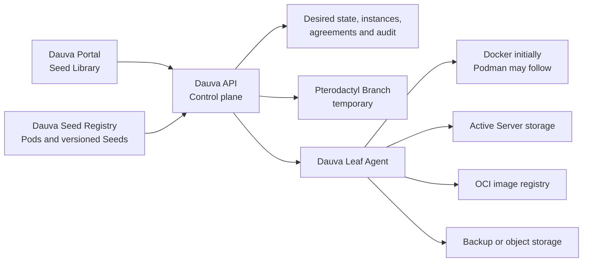

# Dauva native server platform

Status: **Proposed, implementation starting**

Last updated: 2026-07-24

This document is the canonical product and architecture design for Dauva's
native game-server platform. Keep it current when the Seed format, registry,
Leaf Agent, storage model, or migration plan changes. Important implementation
decisions that outlive this design should also receive a short ADR.

If this document moves to a future Dauva umbrella repository, leave a link here
to the new canonical location instead of maintaining two copies.

## Summary

Dauva will own the full product model and control plane for creating and
managing Servers. Pterodactyl may remain available as a temporary Branch during
migration, but it must not define Dauva's catalog, terminology, or long-term
runtime contract.

The platform has two separate distribution concerns:

1. The **Dauva Seed Registry** stores small, versioned Pod and Seed manifests.
2. An **OCI image registry** stores the container images referenced by Seeds.

Large game installations, saves, mods, and backups do not belong in the Seed
Registry. Active data lives on the selected Leaf; backups live on separate
backup or object storage.

## Goals

- Create, start, stop, restart, inspect, update, back up, restore, and safely
  delete Servers without depending on Pterodactyl.
- Make every installable Server type a curated, versioned, reproducible Seed.
- Keep the portal and public API provider-neutral.
- Support one Debian Leaf first and multiple Leaves later.
- Allocate ports, storage, CPU, and memory safely and predictably.
- Record required license and EULA acceptance server-side.
- Preserve existing Servers while the native Branch is introduced.
- Keep provider-specific credentials and runtime details outside the client.

## Initial non-goals

- Running arbitrary administrator-supplied container images.
- Reimplementing Kubernetes.
- A public community marketplace in the first release.
- Live migration or automatic high availability between Leaves.
- Building a full browser file manager or SFTP replacement before native
  provisioning is reliable.
- Converting Pterodactyl Eggs into trusted Seeds automatically.

## Product language

| Term | Meaning |
| --- | --- |
| Seed Library | The catalog administrators see in Dauva. |
| Seed Registry | The versioned technical source behind the Seed Library. |
| Pod | A recognizable collection of related Seeds, such as Minecraft. |
| Seed | A complete, approved, reproducible recipe for one Server type. |
| Server | One installed runtime instance with its own data and settings. |
| Sprouting | Provisioning a Server from a Seed. |
| Branch | A replaceable runtime provider used by the Dauva control plane. |
| Leaf | A machine that can host Servers. |
| Leaf Agent | The restricted Dauva service that manages runtime resources on a Leaf. |
| Withered | A failed Sprouting operation or inactive runtime condition, made explicit by accompanying text. |

A Pod is catalog metadata, not a running workload. A Seed produces a Server.
A Server can contain multiple runtime components, such as a primary game
container and a backup sidecar.

## What is and is not a Seed

The current Pterodactyl-backed catalog contains candidate profiles derived from
Eggs. Those profiles are not native Dauva Seeds while their installation
behavior still depends on an Egg.

Likewise, a running Server is not copied wholesale into the registry. Its
sanitized and repeatable recipe becomes a Seed.

Seed material includes:

- exact container images;
- runtime components and their relationship;
- ports and protocols;
- persistent volume roles;
- supported inputs and secrets;
- resource requirements and presets;
- agreements;
- health and readiness checks;
- graceful stop behavior;
- update and backup capabilities.

Instance data never becomes Seed material:

- worlds and saves;
- passwords, tokens, and private keys;
- player lists and administrator assignments;
- installed user mods;
- logs;
- generated identifiers;
- actual backups.

## Current baseline

The Debian host was inspected read-only on 2026-07-24.

The current real game Servers are:

- Minecraft, with a separate backup sidecar;
- Valheim;
- Core Keeper;
- Satisfactory;
- Factorio;
- Enshrouded, intentionally stopped at the time of inspection.

These Servers run directly through Docker Compose. Pterodactyl Panel and Wings
are active, but Wings had zero game-server containers and zero server volume
directories at the time of inspection. No live game-server migration out of
Pterodactyl is therefore required before native development starts.

The existing API already provides useful foundations:

- provider-neutral public routes and models;
- `IGameServerProvider` as a replaceable runtime boundary;
- managed instance persistence and reconciliation;
- status and power actions;
- autostart behavior;
- safe deletion;
- a Docker client used for existing Compose-managed Servers.

The current API database does not yet pin Seed versions or manifest digests and
does not persist a complete agreement acceptance record. Those are required
before the registry becomes authoritative.

## Target architecture



### Dauva Portal

The portal renders the Seed Library, configuration forms, agreements, progress,
runtime status, and safe lifecycle actions. It never receives provider
credentials or direct Docker access.

### Dauva API

The API is the authoritative control plane. It:

- resolves an exact Seed version and digest;
- validates options and agreements;
- chooses a Branch and later a Leaf;
- persists desired state before provisioning;
- sends idempotent commands to the Branch;
- reconciles desired and observed state;
- stores audit and failure details;
- serves a provider-neutral response to clients.

### Dauva Seed Registry

The initial registry should be Git-backed and compiled by CI into a validated,
immutable index. A database-backed registry service is unnecessary for the
first release.

The API caches the last known valid registry revision. A broken or unreachable
new revision must not remove already installed Seeds or prevent existing
Servers from being managed.

The registry can later be distributed as signed OCI artifacts and support
multiple trusted sources. The Seed Library remains the user-facing name.

### Dauva Leaf Agent

The Leaf Agent owns privileged host operations:

- pulling approved images;
- creating networks, containers, and volumes;
- allocating and reserving ports;
- applying CPU and memory limits;
- starting, stopping, and inspecting components;
- collecting logs and health state;
- invoking backup, restore, and update operations;
- deleting runtime resources only after an authorized control-plane command;
- reporting capacity and observed state.

The long-term API container must not require the Docker socket. During a
single-Leaf proof of concept, the existing Docker integration may implement the
same contract locally, but the privilege boundary must remain explicit so it
can be extracted into the Agent.

### OCI image registry

Seeds reference images by immutable digest. Mutable tags such as `latest` and
`stable` can be shown as channels but cannot be the stored runtime identity.

Game binaries should not automatically be baked into very large images.
SteamCMD-based Seeds may use a small trusted runtime image and install game
content into persistent Leaf storage on first Sprouting. A Leaf-local download
cache can be added later.

## Seed v1 requirements

A Seed v1 manifest must be declarative and contain at least:

- `schemaVersion`;
- immutable Seed `id`;
- semantic `version`;
- `podId`;
- localized title and description;
- supported operating systems and CPU architectures;
- one or more runtime components;
- an immutable image digest per component;
- a primary component;
- ports with protocol, purpose, exposure, and allocation rules;
- volumes with a role such as `data`, `save`, `cache`, or `backup`;
- resource minimums, maximums, and presets;
- typed configuration inputs;
- secret inputs that never receive defaults in the manifest;
- agreements with canonical URL and agreement revision;
- health and readiness checks;
- graceful stop timeout and behavior;
- update, backup, and restore capabilities;
- required restricted runtime capabilities.

Executable installation behavior belongs in reviewed, signed images. The
registry must not permit arbitrary host shell scripts, privileged containers,
host PID or network namespaces, Docker socket mounts, or unrestricted host
paths.

### Multi-component Servers

A Seed can describe a small workload rather than only one container.

The initial example is Minecraft:

- primary component: the Minecraft Server;
- companion component: the backup worker;
- shared read-only or read-write volumes as explicitly declared;
- a secret file for RCON authentication;
- companion lifecycle tied to the primary Server.

Each component receives Dauva ownership labels and the immutable Server and Seed
identities. Creating the same Server command twice must not create duplicates.

## Storage model

The recommended initial Leaf layout is:

```text
/srv/dauva/
  servers/<server-id>/
    data/
    saves/
    config/
    cache/
  backups/<server-id>/
  agent/
```

The exact host paths are Agent implementation details and do not appear in
public Seed manifests. Seeds declare logical volume roles; the Agent resolves
those roles to approved storage roots.

Storage rules:

- active saves use persistent Leaf storage;
- disposable download caches are separately identifiable and garbage
  collectable;
- secrets are stored separately from ordinary configuration;
- deletion distinguishes runtime cleanup from backup retention;
- updates can require a successful pre-update backup;
- backup retention and quotas are control-plane policy, not arbitrary Seed
  values;
- a future Leaf can advertise storage classes such as `fast`, `bulk`, and
  `backup`.

## Port allocation

Seeds declare logical ports, not fixed public host ports.

Every port declaration includes:

- component;
- internal container port;
- TCP, UDP, or both;
- public or private exposure;
- purpose such as game, query, RCON, voice, or file transfer;
- whether two protocols must share the same public number;
- any environment input that receives the allocated value.

The Leaf Agent allocates ports atomically from configured pools and persists
the complete allocation before starting components. Partial allocation failure
must leave no leaked reservations.

## Agreements and secrets

Required agreements remain unchecked in the portal and are independently
validated by the API.

For every accepted agreement, Dauva stores:

- Server and Seed identity;
- Seed version and manifest digest;
- agreement identifier, canonical URL, and revision;
- accepting user;
- timestamp;
- the explicit accepted value.

Passwords and tokens are never stored in the registry or returned in ordinary
Server responses. The API stores them using the platform's protected secret
mechanism and supplies them to the Agent only for the intended Server.

## Instance identity and persistence

Every managed Server must persist:

- Dauva Server ID;
- display name;
- Seed ID, version, and manifest digest;
- Pod ID;
- Branch and Leaf identity;
- selected resource preset and resolved limits;
- allocated ports;
- logical volume assignments;
- desired autostart mode;
- provisioning and runtime state;
- accepted agreement references;
- created-by and audit timestamps;
- last actionable error.

Installed Servers continue using their pinned Seed version until an explicit
update operation succeeds. Publishing a new Seed version never silently
changes an existing Server.

## Lifecycle and reconciliation

Sprouting is an idempotent, observable workflow:

1. Resolve and validate the exact Seed.
2. Validate options, secrets, resources, and agreements.
3. Persist the desired Server in a pending state.
4. Select the Branch and Leaf.
5. Reserve ports and storage.
6. Pull and verify images.
7. Create all components.
8. Start components in dependency order when requested.
9. Wait for readiness.
10. Mark the Server ready or Withered with an actionable failure.

Retries reuse the same Server ID and reservations. A failure after partial
creation must either reconcile forward or clean up only resources owned by that
Server.

Deletion remains name-confirmed in the API. Runtime resources are removed
before the database record. Backup deletion or retention is an explicit policy
and must not be an accidental side effect.

## Security invariants

- The portal never talks directly to a Leaf runtime.
- Registry inputs are untrusted until schema, policy, signature, and digest
  validation succeeds.
- Images are pinned by digest and come from allowed registries.
- Seeds cannot request privileged mode or arbitrary host mounts.
- The Agent accepts only authenticated, authorized, idempotent commands.
- Agent credentials are unique per Leaf and revocable.
- Secrets are not written to logs, manifests, labels, or command responses.
- Resource limits and storage quotas are enforced on the Leaf.
- Ownership labels prevent Dauva from mutating unrelated containers.
- Destructive operations are auditable.

## What Pterodactyl currently supplies

The native platform must progressively replace the useful Wings capabilities:

- container and image lifecycle;
- installation behavior;
- port allocation;
- volume creation;
- CPU and memory enforcement;
- runtime state and power actions;
- live console and logs;
- file access;
- backups and restore;
- scheduled tasks;
- reinstall and update flows;
- node capacity and placement;
- multi-node communication.

Dauva already owns the product-facing catalog, agreements, authentication,
managed instance records, high-level status, autostart, and safe deletion.

Native Sprouting, Leaf isolation, allocation, storage, logs, backups, and
updates are the major remaining capabilities. File management, scheduling, and
multi-Leaf placement follow after the first reliable native Server.

## Delivery plan

### Phase 0: contract and registry

- Define and validate Seed v1.
- Convert the six real Compose Servers into draft manifests.
- Treat the existing Pterodactyl-derived profiles as candidates, not native
  Seeds.
- Add Seed version and digest persistence.
- Add complete agreement audit persistence.
- Compile a deterministic Seed Library index in CI.

### Phase 1: Minecraft vertical slice

- Create a native Minecraft Fabric Seed from the proven live configuration.
- Include the backup companion component.
- Pin all images by digest.
- Support one TCP allocation, persistent data, RCON secret handling, EULA,
  resources, health, start, stop, restart, and delete.
- Sprout a disposable test Server without touching the existing Minecraft
  Server.

Acceptance criteria:

- no Pterodactyl API or Egg is involved;
- repeating a create request cannot duplicate the Server;
- a host or API restart preserves control and state;
- a failed Sprouting operation is actionable and safely retryable;
- deleting the test Server removes only its owned runtime data according to
  the selected backup-retention policy;
- the existing Minecraft Server remains uninterrupted.

### Phase 2: current Server set

Convert and validate:

1. Valheim;
2. Core Keeper;
3. Factorio;
4. Satisfactory;
5. Enshrouded.

This phase adds UDP and paired-port allocation, SteamCMD installation,
game-specific readiness, graceful shutdown, and larger storage behavior.

### Phase 3: operational completeness

- live log streaming and console;
- backup and restore UI;
- update and rollback;
- scheduled tasks;
- registry signing and trusted sources;
- Leaf capacity reporting;
- stronger secret storage;
- remove direct Docker access from the API.

### Phase 4: migration and retirement

- Adopt or recreate existing Compose Servers one at a time.
- Back up and validate before changing ownership.
- Keep the legacy and Pterodactyl Branches available during migration.
- Remove Pterodactyl only after no managed Server depends on it.
- Add additional Leaves and scheduling after the single-Leaf path is stable.

## Initial decisions

These are the current working decisions and should change only deliberately:

1. The Seed Registry is Git-backed first; a custom registry service comes
   later only if needed.
2. OCI images and large game data are not stored in the Seed Registry.
3. A Seed is curated and reproducible, not an arbitrary Docker launch form.
4. A running Server is source material for a Seed, never copied into the
   registry with its private data.
5. Seeds support multiple components.
6. Existing Servers remain untouched while a disposable Minecraft Fabric
   Server proves the native path.
7. Pterodactyl remains a temporary optional Branch, not the Dauva domain model.
8. Docker is the first runtime because it is already present on the Debian
   Leaf; the contract must not permanently depend on Docker-specific client
   behavior.

## Open design questions

- Should the first Agent use control-plane push over mTLS, or maintain an
  outbound authenticated connection to the API?
- Which protected store should hold Server secrets before multi-Leaf support?
- Should the initial backup target be the existing host backup storage, a NAS,
  or S3-compatible object storage?
- When should Git-compiled Seed bundles also be published as signed OCI
  artifacts?
- Which file-management capability is actually required after logs, backups,
  and configuration editing exist in Dauva?
