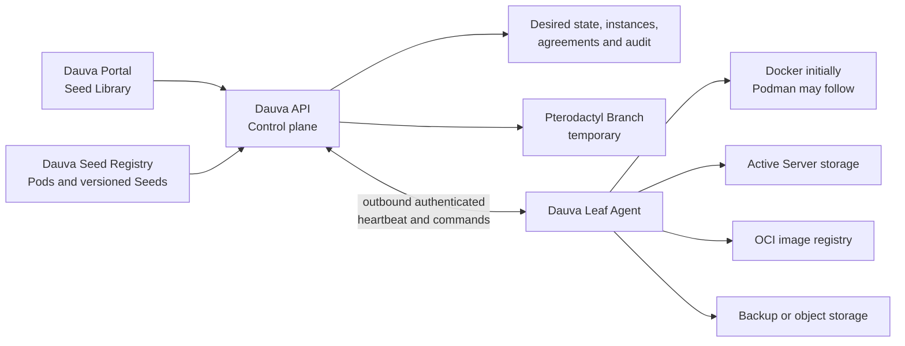

# Dauva native server platform

Status: **Phase 3 in progress; authenticated external-Leaf Sprouting proven on develop**

Last updated: 2026-07-26

This document is the canonical product and architecture design for Dauva's
native game-server platform. Keep it current when the Seed format, registry,
Leaf Agent, storage model, or migration plan changes. Important implementation
decisions that outlive this design should also receive a short ADR.

If this document moves to a future Dauva umbrella repository, leave a link here
to the new canonical location instead of maintaining two copies.

## Summary

Dauva will own the full product model and control plane for creating and
managing Servers. Pterodactyl may remain available as a temporary Branch during
migration, but it must not define Dauva's catalog, terminology, or long-term
runtime contract.

The platform has two separate distribution concerns:

1. The **Dauva Seed Registry** stores small, versioned Pod and Seed manifests.
2. An **OCI image registry** stores the container images referenced by Seeds.

Large game installations, saves, mods, and backups do not belong in the Seed
Registry. Active data lives on the selected Leaf; backups live on separate
backup or object storage.

## Goals

- Create, start, stop, restart, inspect, update, back up, restore, and safely
  delete Servers without depending on Pterodactyl.
- Make every installable Server type a curated, versioned, reproducible Seed.
- Keep the portal and public API provider-neutral.
- Support one Debian Leaf first and multiple Leaves later.
- Allocate ports, storage, CPU, and memory safely and predictably.
- Record required license and EULA acceptance server-side.
- Preserve existing Servers while the native Branch is introduced.
- Keep provider-specific credentials and runtime details outside the client.

## Initial non-goals

- Running arbitrary administrator-supplied container images.
- Reimplementing Kubernetes.
- A public community marketplace in the first release.
- Live migration or automatic high availability between Leaves.
- Building a full browser file manager or SFTP replacement before native
  provisioning is reliable.
- Converting Pterodactyl Eggs into trusted Seeds automatically.

## Product language

| Term | Meaning |
| --- | --- |
| Seed Library | The catalog administrators see in Dauva. |
| Seed Registry | The versioned technical source behind the Seed Library. |
| Pod | One game family containing related Server variants, such as Minecraft. |
| Seed | A complete, approved, reproducible recipe for one Server type. |
| Server | One installed runtime instance with its own data and settings. |
| Sprouting | Provisioning a Server from a Seed. |
| Branch | A replaceable runtime provider used by the Dauva control plane. |
| Leaf | A machine that can host Servers. |
| Leaf Agent | The restricted Dauva service that manages runtime resources on a Leaf. |
| Withered | A failed Sprouting operation or inactive runtime condition, made explicit by accompanying text. |
| Mod Profile | An optional reusable, versioned selection such as Vanilla, Quality of life, or a curated modpack. |
| Mod Selection | The administrator's desired mods and permitted update channels for one Server. |
| Mod Lock | The immutable resolved mod versions, dependencies, sources, checksums, load order, and compatibility context applied to one Server revision. |

A Pod is catalog metadata, not a running workload or genre. Genres are Seed
labels used for discovery and filtering. A Seed produces a Server.
A Server can contain multiple runtime components, such as a primary game
container and a backup sidecar.

## What is and is not a Seed

The current Pterodactyl-backed catalog contains candidate profiles derived from
Eggs. Those profiles are not native Dauva Seeds while their installation
behavior still depends on an Egg.

Likewise, a running Server is not copied wholesale into the registry. Its
sanitized and repeatable recipe becomes a Seed.

Seed material includes:

- exact container images;
- runtime components and their relationship;
- ports and protocols;
- persistent volume roles;
- supported inputs and secrets;
- resource requirements and presets;
- agreements;
- health and readiness checks;
- graceful stop behavior;
- update and backup capabilities;
- supported mod ecosystems and the declarative mod-management contract.

Instance data never becomes Seed material:

- worlds and saves;
- passwords, tokens, and private keys;
- player lists and administrator assignments;
- installed user mods and per-Server mod configuration;
- logs;
- generated identifiers;
- actual backups.

## Current baseline

The Debian host was inspected read-only on 2026-07-24.

The current real game Servers are:

- Minecraft, with a separate backup sidecar;
- Valheim;
- Core Keeper;
- Satisfactory;
- Factorio;
- Enshrouded, intentionally stopped at the time of inspection.

These Servers run directly through Docker Compose. Pterodactyl Panel and Wings
are active, but Wings had zero game-server containers and zero server volume
directories at the time of inspection. No live game-server migration out of
Pterodactyl is therefore required before native development starts.

The existing API already provides useful foundations:

- provider-neutral public routes and models;
- `IGameServerProvider` as a replaceable runtime boundary;
- managed instance persistence and reconciliation;
- status and power actions;
- autostart behavior;
- safe deletion;
- a Docker client used for existing Compose-managed Servers.

The API now persists the selected resource preset, resolved non-secret options,
Seed version, Seed manifest digest, and compiled registry digest for every
native Server. Agreement acceptance is stored in a separate audit record with
the Server, Seed, agreement, accepting user, URL, revision, and timestamp.

Seed v1 is implemented as JSON Schema plus stricter policy validation. The
registry contains six game-family Pods and six sanitized Seeds. Minecraft Fabric,
Factorio, Core Keeper, and Valheim are stable `1.0.0` Seeds after their own
native lifecycle tests. Satisfactory and Enshrouded remain candidates and are
not published in the production Seed Library until their larger memory and
runtime behavior is proven.

The native Docker Branch and Pterodactyl Branch are registered side by side.
After the successful Minecraft acceptance test, native Docker became the
default Branch for new Servers. Existing Servers were not adopted, restarted,
or otherwise modified.

Development of the extracted Leaf boundary takes place only on the fully
isolated `develop.jorishoef.nl` control plane. That environment has its own
API, database, authentication cookies, data-protection keys, Docker-in-Docker
runtime, networks, volumes, and storage. It does not mount the host Docker
socket or share production Server state.

## Target architecture



### Dauva Portal

The portal renders the Seed Library, configuration forms, agreements, progress,
runtime status, and safe lifecycle actions. It never receives provider
credentials or direct Docker access.

### Dauva API

The API is the authoritative control plane. It:

- resolves an exact Seed version and digest;
- validates options and agreements;
- chooses a Branch and later a Leaf;
- persists desired state before provisioning;
- sends idempotent commands to the Branch;
- reconciles desired and observed state;
- stores audit and failure details;
- serves a provider-neutral response to clients.

### Dauva Seed Registry

The initial registry should be Git-backed and compiled by CI into a validated,
immutable index. A database-backed registry service is unnecessary for the
first release.

The API caches the last known valid registry revision. A broken or unreachable
new revision must not remove already installed Seeds or prevent existing
Servers from being managed.

The registry can later be distributed as signed OCI artifacts and support
multiple trusted sources. The Seed Library remains the user-facing name.

### Dauva Leaf Agent

The Leaf Agent owns privileged host operations:

- pulling approved images;
- creating networks, containers, and volumes;
- allocating and reserving ports;
- applying CPU and memory limits;
- starting, stopping, and inspecting components;
- collecting logs and health state;
- invoking backup, restore, and update operations;
- deleting runtime resources only after an authorized control-plane command;
- reporting capacity and observed state.

Enrollment and transport follow
[ADR 0001](../adr/0001-outbound-device-code-leaf-enrollment.md). The Agent
generates its machine key locally, shows a short device code, waits for portal
approval, and then maintains outbound authenticated communication. No inbound
Docker, SSH, or Agent administration port is part of the contract.

Distribution and client ownership follow
[ADR 0002](../adr/0002-leaf-distribution-and-client-surfaces.md). The Flutter
web and Windows builds are Portal clients; the separately packaged persistent
Linux Agent performs privileged runtime work. Sprouting sends the enrolled
Agent a command rather than producing a different installer for each Server.

The long-term API container must not require the Docker socket. During a
single-Leaf proof of concept, the existing Docker integration may implement the
same contract locally, but the privilege boundary must remain explicit so it
can be extracted into the Agent.

Managed hosting, if it becomes a product, stays behind a scheduler and billing
gateway and enrolls ordinary fleet Leaves. The core API and Seed model do not
adopt provider SKUs or payment state. The commercial gates and unit-economics
model are defined in
[Managed hosting: separation and economics](../product/managed-hosting-separation-and-economics.md).

### OCI image registry

Seeds reference images by immutable digest. Mutable tags such as `latest` and
`stable` can be shown as channels but cannot be the stored runtime identity.

Game binaries should not automatically be baked into very large images.
SteamCMD-based Seeds may use a small trusted runtime image and install game
content into persistent Leaf storage on first Sprouting. A Leaf-local download
cache can be added later.

## Seed v1 requirements

A Seed v1 manifest must be declarative and contain at least:

- `schemaVersion`;
- immutable Seed `id`;
- semantic `version`;
- `podId`;
- one or more discovery `genres`;
- localized title and description;
- supported operating systems and CPU architectures;
- one or more runtime components;
- an immutable image digest per component;
- a primary component;
- ports with protocol, purpose, exposure, and allocation rules;
- volumes with a role such as `data`, `save`, `cache`, or `backup`;
- resource minimums, maximums, and presets;
- typed configuration inputs;
- secret inputs that never receive defaults in the manifest;
- agreements with canonical URL and agreement revision;
- health and readiness checks;
- graceful stop timeout and behavior;
- update, backup, and restore capabilities;
- required restricted runtime capabilities.

Each Seed declares exactly one `podId`. A Pod groups one or more related
Server variants for the same game family, and has no arbitrary per-Pod Seed
limit. The compiled catalog derives membership from the Seeds so Pod and Seed
manifests cannot maintain conflicting lists.

Executable installation behavior belongs in reviewed, signed images. The
registry must not permit arbitrary host shell scripts, privileged containers,
host PID or network namespaces, Docker socket mounts, or unrestricted host
paths.

### Multi-component Servers

A Seed can describe a small workload rather than only one container.

The initial example is Minecraft:

- primary component: the Minecraft Server;
- companion component: the backup worker;
- shared read-only or read-write volumes as explicitly declared;
- a secret file for RCON authentication;
- companion lifecycle tied to the primary Server.

Each component receives Dauva ownership labels and the immutable Server and Seed
identities. Creating the same Server command twice must not create duplicates.

## Storage model

The implemented initial Leaf layout is:

```text
/mnt/data/dauva/
  servers/<server-id>/
    .dauva-owned.json
    volumes/
      data/
      backups/
```

The exact host paths are Agent implementation details and do not appear in
public Seed manifests. Seeds declare logical volume roles; the Agent resolves
those roles to approved storage roots.

On the first Debian Leaf this root lives on the dedicated 1 TB Docker/data
filesystem, not on the smaller operating-system filesystem. Local companion
backups initially share that data disk; off-host backup storage remains a
separate operational milestone.

Storage rules:

- active saves use persistent Leaf storage;
- disposable download caches are separately identifiable and garbage
  collectable;
- secret inputs are excluded from Seed manifests and ordinary Server records;
- the current single-Leaf implementation supplies secrets ephemerally while
  Sprouting and only to the runtime component that requires them;
- deletion distinguishes runtime cleanup from backup retention;
- updates can require a successful pre-update backup;
- backup retention and quotas are control-plane policy, not arbitrary Seed
  values;
- a future Leaf can advertise storage classes such as `fast`, `bulk`, and
  `backup`.

## Port allocation

Seeds declare logical ports, not fixed public host ports.

Every port declaration includes:

- component;
- internal container port;
- TCP, UDP, or both;
- public or private exposure;
- purpose such as game, query, RCON, voice, or file transfer;
- whether two protocols must share the same public number;
- any environment input that receives the allocated value.

The Leaf Agent allocates ports atomically from configured pools and persists
the complete allocation before starting components. Partial allocation failure
must leave no leaked reservations.

The native Docker Branch now supports single dynamic ports and contiguous
paired allocations. Valheim proved a two-port public UDP pair, while Factorio
proved that a private administration port is not published to the host.

## Agreements and secrets

Required agreements remain unchecked in the portal and are independently
validated by the API.

For every accepted agreement, Dauva stores:

- Server and Seed identity;
- Seed version and manifest digest;
- agreement identifier, canonical URL, and revision;
- accepting user;
- timestamp;
- the explicit accepted value.

Passwords and tokens are never stored in the registry, ordinary instance
options, or Server responses. In the current single-Leaf implementation they
exist only during the Sprouting request and are supplied to the intended
runtime container as required by the game. Durable protected secret storage is
still required before updates, migration, or multi-Leaf reconciliation can
recreate a Server without asking the administrator again.

## Instance identity and persistence

Every managed Server must persist:

- Dauva Server ID;
- display name;
- Seed ID, version, and manifest digest;
- Pod ID;
- Branch and Leaf identity;
- selected resource preset and resolved limits;
- allocated ports;
- logical volume assignments;
- desired autostart mode;
- provisioning and runtime state;
- accepted agreement references;
- desired Mod Selection or Mod Profile revision, when enabled;
- applied Mod Lock digest and compatibility context, when enabled;
- created-by and audit timestamps;
- last actionable error.

Installed Servers continue using their pinned Seed version until an explicit
update operation succeeds. Publishing a new Seed version never silently
changes an existing Server.

## Mod management

Mod management is a hosting-neutral desired-state capability. It must work the
same way on a user-owned Leaf and a future managed Leaf. It is not a Leaf-side
plugin store, an arbitrary host file manager, or permission to run installer
scripts as root.

The product boundary is:

```text
Portal chooses -> Seed defines capability -> control plane resolves and locks
-> Sprout carries the lock -> Leaf verifies and applies
```

### Responsibilities

| Layer | Responsibility |
| --- | --- |
| Portal | Show Vanilla and curated profiles first, expose search and deeper choices only when requested, preview compatibility/restart/backup effects, and submit desired selections. |
| Seed | Declare the game-specific mod adapter, allowed sources, game-version compatibility input, target volume roles, load-order semantics, configuration surface, and lifecycle capabilities. |
| Control plane and resolver | Read source metadata, enforce source and policy rules, resolve dependencies and conflicts, produce an immutable Mod Lock, persist its digest, and audit the actor and requested change. |
| Sprout command | Carry the validated Mod Lock digest and exact artifact references as part of the Server revision without embedding source credentials. |
| Leaf Agent | Download only allowed artifacts, verify checksums or signatures, use a disposable cache, stage the complete revision, switch it atomically, restart when required, health-check, and roll back on failure. |

The Leaf deliberately does not understand Factorio, Fabric, Modrinth, Steam
Workshop, or another catalog. Game-specific dependency resolution belongs in a
versioned resolver adapter selected by the Seed. If an ecosystem requires its
own downloader, such as Steam Workshop, that downloader is a curated
digest-pinned Seed component or operation; it is never an arbitrary host
script.

### Data model

A mod-capable Seed declares a `modManagement` capability. The exact v2 schema
can evolve, but the contract includes:

- adapter identifier and supported adapter contract version;
- allowed artifact sources and source-specific project identifiers;
- compatible game, loader, and Seed version inputs;
- logical installation and configuration volume roles;
- dependency, conflict, optional-dependency, and load-order semantics;
- whether a change requires stop, restart, save migration, or full reinstall;
- backup, health-check, and rollback requirements;
- whether local/private artifacts are allowed and how they are verified.

A Mod Profile is an optional curated, versioned desired selection. It may live
in the Seed Registry or another signed trusted registry, but it does not create
a different Server type and it does not silently mutate installed Servers.

A per-Server Mod Selection records intent: requested projects, permitted
channels, pinned or floating constraints, disabled entries, and safe
configuration. The resolver turns that intent into a Mod Lock containing at
least:

- exact game, loader, Seed, adapter, and profile revisions;
- every exact mod and transitive dependency version;
- canonical source and immutable artifact identifier;
- content size, checksum or signature, and license metadata when available;
- deterministic load order and resolved conflicts;
- creation time, resolver version, and complete lock digest.

The Mod Selection can change without rewriting the Seed. The applied Mod Lock
cannot change in place: every successful resolution creates a new immutable
Server revision. This preserves reproducibility while still allowing friendly
one-click updates.

### Apply, update, and rollback

The same transaction is used during initial Sprouting and later mod changes:

1. Validate the desired selection against the pinned game and Seed revision.
2. Resolve a candidate Mod Lock without changing the running Server.
3. Show incompatible removals, configuration changes, required restart, and
   estimated download/storage impact.
4. Take a verified backup when the Seed or policy requires one.
5. Download into a staging area and verify every artifact.
6. Stop the Server only when required, then atomically switch the staged
   revision into place.
7. Start the Server and wait for Seed-defined readiness.
8. Persist the new applied lock only after health succeeds.
9. Restore the previous files, configuration, lock, and runtime state if any
   step fails.

Publishing a newer mod or changing a Mod Profile never updates a Server
silently. Administrators may choose `pinned`, `notify`, or `scheduled` policy;
the first implementation defaults to `pinned`. Scheduled updates still create
a candidate lock, backup, audit event, and rollback point.

### Creator experience

Mods become their own character-creator page only for Seeds that declare the
capability. The first view contains large, self-explanatory choices:

- **Vanilla** — no mods;
- **Curated** — a small set of compatible Mod Profiles;
- **Custom** — search, dependency details, conflicts, and load order.

The Review page shows one human-readable modpack summary and lock state rather
than a wall of artifact versions. Exact versions and checksums remain available
as progressive disclosure. Existing Servers use the same surface for a
previewable revision change, not an unrelated file-management screen.

### Security, licensing, and operations

- Mod sources are deny-by-default and scoped per Seed adapter.
- Every artifact is immutable or content-hashed before the Leaf can apply it.
- Registry credentials are protected control-plane secrets and never appear in
  a Seed, Mod Lock, label, log, or ordinary command result.
- Arbitrary host hooks, privileged containers, mutable download URLs, and
  unverified native installers are rejected.
- Mod code runs only inside the Server's existing runtime sandbox and resource
  limits; a trusted source is not treated as trusted code.
- Source terms, redistribution limits, author licenses, and deletion requests
  are part of adapter policy. A lock may reference an artifact Dauva is allowed
  to download without granting Dauva redistribution rights.
- Download caches are disposable and quota-controlled. Active mod files,
  configuration, locks, and rollback state are owned Server data.
- Managed hosting uses the identical resolver and Leaf protocol. Its gateway
  may add cache, bandwidth, storage, and support cost weights, but cannot fork
  the mod model.

The first vertical slice should use Factorio because its portal exposes clear
game-version metadata and dependency information. It should prove Vanilla,
one curated profile, one custom selection, dependency resolution, backup,
restart, health, and rollback before additional adapters are added.

## Lifecycle and reconciliation

Sprouting is an idempotent, observable workflow:

1. Resolve and validate the exact Seed.
2. Validate options, secrets, resources, and agreements.
3. Persist the desired Server in a pending state.
4. Select the Branch and Leaf.
5. Reserve ports and storage.
6. Pull and verify images.
7. Create all components.
8. Start components in dependency order when requested.
9. Wait for readiness.
10. Mark the Server ready or Withered with an actionable failure.

Retries reuse the same Server ID and reservations. A failure after partial
creation must either reconcile forward or clean up only resources owned by that
Server.

Deletion remains name-confirmed in the API. Runtime resources are removed
before the database record. Backup deletion or retention is an explicit policy
and must not be an accidental side effect.

Once the exact deletion name has been confirmed, provider cleanup and record
cleanup continue independently of the browser request lifetime. A disconnected
portal must not leave a stopped container, Server record, or owned storage
behind after a confirmed deletion.

## Security invariants

- The portal never talks directly to a Leaf runtime.
- Registry inputs are untrusted until schema, policy, signature, and digest
  validation succeeds.
- Images are pinned by digest and come from allowed registries.
- Mod artifacts come from Seed-allowed sources and match their locked checksum
  or signature before they become active.
- Seeds cannot request privileged mode or arbitrary host mounts.
- Mod adapters cannot request arbitrary host scripts or bypass the Server
  sandbox.
- The Agent accepts only authenticated, authorized, idempotent commands.
- Agent credentials are unique per Leaf and revocable.
- Secrets are not written to logs, manifests, labels, or command responses.
- Resource limits and storage quotas are enforced on the Leaf.
- Ownership labels prevent Dauva from mutating unrelated containers.
- Destructive operations are auditable.

## What Pterodactyl currently supplies

The native platform must progressively replace the useful Wings capabilities:

- container and image lifecycle;
- installation behavior;
- port allocation;
- volume creation;
- CPU and memory enforcement;
- runtime state and power actions;
- live console and logs;
- file access;
- backups and restore;
- scheduled tasks;
- reinstall and update flows;
- node capacity and placement;
- multi-node communication.

Dauva already owns the product-facing catalog, agreements, authentication,
managed instance records, high-level status, autostart, and safe deletion.

Native Sprouting, resource enforcement, dynamic and paired allocation, owned
storage, status, power, and safe deletion are now live on one Docker Leaf.
Leaf-agent isolation, logs, restore, general backup control, updates, and
protected durable secrets are the major remaining capabilities. File
management, scheduling, and multi-Leaf placement follow.

## Delivery plan

### Phase 0: contract and registry — complete

- Define and validate Seed v1.
- Convert the six real Compose Servers into draft manifests.
- Treat the existing Pterodactyl-derived profiles as candidates, not native
  Seeds.
- Add Seed version and digest persistence.
- Add complete agreement audit persistence.
- Compile a deterministic Seed Library index in CI.

### Phase 1: Minecraft vertical slice — complete

- Create a native Minecraft Fabric Seed from the proven live configuration.
- Include the backup companion component.
- Pin all images by digest.
- Support one TCP allocation, persistent data, RCON secret handling, EULA,
  resources, health, start, stop, restart, and delete.
- Sprout a disposable test Server without touching the existing Minecraft
  Server.

Acceptance criteria:

- no Pterodactyl API or Egg was involved;
- the API and Docker resources retain a stable Dauva Server identity;
- an API restart preserved control and state;
- failed availability and stopped-health states were actionable and covered by
  regression tests;
- create, healthy status, stop, start, restart, and name-confirmed delete all
  succeeded through the live portal;
- deleting the test Server removed its two containers, private network, owned
  storage, instance record, and agreement audit record;
- the existing Minecraft Server and the other five existing game Servers
  remained uninterrupted.

The acceptance Server used an automatically allocated port in the configured
native pool and was removed after the test. Candidate Seeds were enabled only
for the acceptance window and disabled again after promotion of Minecraft
Fabric `1.0.0` to stable.

### Phase 2: current Server set — partially complete

Converted and validated:

1. Valheim;
2. Core Keeper;
3. Factorio;

Remaining candidates:

4. Satisfactory;
5. Enshrouded.

This phase has added dynamic UDP and contiguous paired-port allocation,
UID/GID-aware volume ownership, ephemeral secret handoff, graceful shutdown,
and larger owned storage behavior. Satisfactory and Enshrouded wait for the
planned RAM upgrade and full disposable lifecycle tests.

Live acceptance evidence:

- Factorio completed create, running status, stop, start, restart, and delete
  with a dynamic public UDP port and an internal-only RCON port.
- Core Keeper completed create, running status, stop, start, and delete with
  data and cache volumes on the dedicated data disk.
- Valheim completed create, running status, graceful stop, start, and
  delete-while-running with a contiguous public UDP pair.
- Every test used a digest-pinned image and enforced CPU and memory limits.
- Secret values were absent from ordinary instance options, and each required
  agreement produced exactly one server-side acceptance record.
- Confirmed running deletion completed container, record, and owned-storage
  cleanup even when the original portal request no longer needed to remain
  connected.

### Phase 3: operational completeness

Completed on the production-isolated develop stack:

- device-code Leaf enrollment and revocation;
- outbound heartbeats, capacity, leased commands, and completion results;
- extracted Linux Leaf Agent with a labeled Docker executor;
- portal Leaf inventory, Add Leaf, and Choose Leaf flows;
- route Sprouting through a selected Leaf;

Live external-Leaf acceptance on 2026-07-26 enrolled an Agent through the
device-code protocol, observed it online with Docker 27.5.1 capacity, completed
a leased probe, and completed a real Sprout in the isolated Docker-in-Docker
runtime. The disposable proof used Alpine pinned to
`sha256:48b0309ca019d89d40f670aa1bc06e426dc0931948452e8491e3d65087abc07d`.
The running component and private network carried the expected Dauva ownership
labels; the component enforced a 64 MiB memory limit, 0.10 CPU limit, dropped
all Linux capabilities, enabled `no-new-privileges`, used owned persistent
storage, and persisted the successful command result in the develop database.
The develop API had no host Docker socket and no production runtime was
addressed.

Next operational slices:

- live log streaming and console;
- backup and restore UI;
- update and rollback;
- Factorio-first Mod Profiles, Mod Selection, immutable Mod Locks, and atomic
  mod update rollback;
- scheduled tasks;
- registry signing and trusted sources;
- Leaf capacity reporting;
- stronger secret storage;
- remove direct Docker access from the API.

### Phase 4: migration and retirement

- Adopt or recreate existing Compose Servers one at a time.
- Back up and validate before changing ownership.
- Keep the legacy and Pterodactyl Branches available during migration.
- Remove Pterodactyl only after no managed Server depends on it.
- Add additional Leaves and scheduling after the single-Leaf path is stable.

## Initial decisions

These are the current working decisions and should change only deliberately:

1. The Seed Registry is Git-backed first; a custom registry service comes
   later only if needed.
2. OCI images and large game data are not stored in the Seed Registry.
3. A Seed is curated and reproducible, not an arbitrary Docker launch form.
4. A running Server is source material for a Seed, never copied into the
   registry with its private data.
5. Seeds support multiple components.
6. Existing Servers remain untouched while disposable native Servers prove
   each Seed before it becomes stable.
7. Pterodactyl remains a temporary optional Branch, not the Dauva domain model.
8. Docker is the first runtime because it is already present on the Debian
   Leaf; the contract must not permanently depend on Docker-specific client
   behavior.
9. Leaves use one persistent Agent and an outbound device-code enrollment
   protocol; self-hosted and managed Leaves share that boundary.
10. Mod choices are instance desired state; compatibility capability belongs to
    the Seed, exact resolution belongs to an immutable Mod Lock, and execution
    remains a generic verified Leaf operation.
11. Mod management uses the same protocol on self-hosted and managed Leaves and
    does not become a hosting-only feature.

## Open design questions

- Which protected store should hold Server secrets before multi-Leaf support?
- Should the initial backup target be the existing host backup storage, a NAS,
  or S3-compatible object storage?
- When should Git-compiled Seed bundles also be published as signed OCI
  artifacts?
- Which file-management capability is actually required after logs, backups,
  and configuration editing exist in Dauva?
- Which trusted catalog sources and license policies should follow the initial
  Factorio Mod Portal adapter?
- Should signed Mod Profiles live beside Seeds or in a separately delegated
  trusted registry once community curators are supported?
