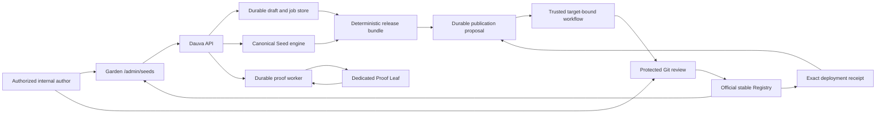

# Dauva Internal Seed Studio

Status: **approved normative specification**

Specification version: **1.2.2**

Approved and last updated: **2026-08-10**

This document defines the first production release of Dauva's internal Seed
Studio and the production-ready Seed Creator behind it. It is intentionally
strict. Implementation work may not weaken a requirement silently; a changed
product or security decision must update this document first.

The Studio is an internal authoring and proofing workspace. It is not a public
marketplace, a community submission flow, a custom Registry, or an arbitrary
container launcher.

Related canonical contracts:

- [Native Server platform](dauva-native-server-platform.md)
- [Registry policy](../../registry/README.md)
- [Seed v1 schema](../../schemas/seed-v1.schema.json)
- [Pod v1 schema](../../schemas/pod-v1.schema.json)
- [Seed proof v1 schema](../../schemas/seed-proof-v1.schema.json)
- [Protected-publication statement](../../schemas/seed-studio-publication-v1.schema.json)
- [Registry deployment receipt](../../schemas/seed-registry-deployment-receipt-v1.schema.json)
- [Workflow-only publication API](../../schemas/seed-studio-publication-internal-v1.openapi.json)

## 1. Normative language and precedence

The words **MUST**, **MUST NOT**, **SHOULD**, **SHOULD NOT**, and **MAY** are
normative.

When requirements appear to conflict, use this precedence:

1. security, isolation, secrets, and legal acceptance requirements in this
   document;
2. the canonical Seed, Pod, and proof schemas and Registry policy validator;
3. the native Server platform architecture;
4. user-interface convenience.

The existing machine-readable schemas remain the field-level contract for
existing v1 Registry artifacts. New Studio wire artifacts are not
implementation-ready until the schema-freeze gate in Section 6.2 is complete.
After that gate, those committed schemas are the field-level contract subject
to the precedence above. This document adds product behavior, workflow,
security, proof, and release gates. A Studio feature is incomplete when it
satisfies only the form or only the schema.

## 2. Fixed product decisions

The first release uses the following decisions:

- The Studio **MUST** be a separate privileged Admin workspace in the current
  Garden/Portal V2 shell at `/admin/seeds`.
- The normal Seed Library and Sprout Journey **MUST** remain read-only consumer
  experiences. Authoring controls **MUST NOT** appear in the Add Server flow.
- Only active Dauva Administrators with the `manage.seeds` permission may use
  the Studio. The API **MUST** additionally require the Admin role for this
  first internal release.
- The canonical stable Registry remains Git-backed, immutable at runtime, and
  governed by Deucarian.
- Working drafts, immutable revisions, validation runs, proof runs, and export
  records **MUST** live outside the stable Registry.
- The Studio **MUST NOT** write to the deployed Registry, push a protected
  target branch, merge a pull request, or publish a stable Seed directly.
- The Studio's final mutation is a durable target-bound publication proposal.
  A trusted workflow verifies and transactionally applies its deterministic
  release bundle to a proposal branch, then opens or resumes a protected pull
  request. A human review and protected merge remain mandatory.
- Develop proposals target only `Deucarian/dauva-seeds:develop`; Production
  proposals target only `Deucarian/dauva-seeds:main`. Content, credentials,
  receipts, state, or callbacks may never cross those environments.
- Candidate code may execute only on an explicitly enrolled, dedicated
  non-production Proof Leaf.
- Public accounts, public submissions, community moderation, third-party trust
  levels, custom Registry federation, and marketplace ranking are out of scope.

These decisions keep the official trust boundary narrow while eliminating the
need to hand-author Seed JSON.

## 3. Goals

The release **MUST** let an authorized internal author:

1. create a Seed variant in an existing Pod;
2. create a new Pod together with at least two meaningful Seed variants;
3. clone an existing stable Seed into a new versioned proposal;
4. re-proof an unchanged existing stable Seed without inventing an RC;
5. use OCI, SteamCMD, LinuxGSM, or Dauva source adapters for safe suggestions;
6. author every field required by the current Pod and Seed contracts;
7. resolve mutable OCI discovery tags to immutable runtime digests safely;
8. validate a complete workspace against the current Registry overlay;
9. freeze an immutable release-candidate or stable-reproof revision;
10. run and follow a durable disposable lifecycle proof;
11. review a human-readable diff and exact canonical JSON;
12. export an atomic release bundle that passes all repository checks;
13. submit and follow that exact export through protected Git review and
    Registry deployment without downloading a ZIP or running a command; and
14. resume safely after a browser, API, worker, workflow, or Proof Leaf restart.

The Creator **MUST** cover every current stable Seed without semantic loss. A
field that exists in a current manifest may not require a raw-file workaround.

## 4. Explicit non-goals

The first release **MUST NOT** include:

- public or invited community author accounts;
- self-service publication, signing, or trust elevation;
- arbitrary Docker Compose, Kubernetes, Pterodactyl, or live-Server import;
- private OCI registries or private-network source resolution;
- copying worlds, saves, players, mods, logs, credentials, backups, or other
  instance data into a Seed;
- building or hosting OCI images;
- arbitrary commands, entrypoints, host scripts, host paths, devices,
  capabilities, namespaces, or Docker socket access;
- automatic legal or EULA acceptance;
- automatic approval or merge of an exported Registry change;
- deployment before an exact protected merge;
- proof execution on a production Leaf, Windows Leaf, or outbound-only Leaf;
- a replacement for the existing normal Garden Sprout experience; or
- cryptographic distribution signing beyond the separately governed Registry
  signing work. Exact digests and authenticated internal transport remain
  mandatory in this release. This non-goal does not waive the internal
  per-Leaf proof signature and Studio export attestation required below.

A later feature may add a carefully sanitized Compose proposal importer, but
it must receive its own specification and threat model.

## 5. Current baseline and mandatory hardening

As of 2026-08-09, the compiled Registry contains eighteen stable Seeds.
Fourteen carry legacy proof-v1 receipts; Factorio Stable, Minecraft Fabric,
Satisfactory Experimental, and Valheim BepInEx are reported as `unproven` and
have no receipt. Legacy receipts are reported as `legacy`, not `proven`, because
they are neither authenticated nor exactly bound under proof-v2. Consequently
all eighteen Seeds and all nine recommended Seeds still lack a current exact
Studio-v2 proof. The present validator allows that migration state; none of the
legacy evidence authorizes Studio release or runtime availability.

The Studio **MUST NOT** enter general internal use until all of the following
are true:

- every stable Seed offered for a new Sprout has a current, non-expired proof;
- every recommended Seed has a current, non-expired proof for its exact
  proof-relevant contract;
- a stable unproven or expired Seed is unavailable for new Sprouts and cannot
  be recommended;
- the compiled Registry records deterministic proof facts and `expiresAt`;
  the API evaluates current availability from status, compatibility, exact
  proof binding, and expiry using its injected clock instead of status alone;
- proof promotion validates the complete proof schema and exact digest
  binding plus trusted Leaf/API attestations;
- pull-request CI runs tests, validation, and deterministic compilation;
- candidate update commits include immutable `registry/history` changes;
- update discovery ignores draft, candidate, and withered Seeds unless an
  explicit candidate operation targets them;
- draft creation no longer writes incomplete proposals directly into
  `registry/seeds`; and
- the API recomputes and verifies the compiled Registry digest instead of only
  checking that a supplied digest is non-empty.

Previously gathered lifecycle evidence without a canonical receipt may help a
human investigation, but it **MUST NOT** be treated as a valid proof receipt.
An unchanged existing stable Seed may be re-proofed at its exact stable
version; it does not need a synthetic RC merely to retire legacy proof debt.

## 6. System boundary



The browser **MUST** communicate only with the Dauva API. It **MUST NOT**
receive Leaf credentials, Registry credentials, Git credentials, image
registry credentials, Docker access, or filesystem paths.

The API owns authorization, persistence, orchestration, concurrency, audit,
and idempotency. The canonical Seed engine owns default generation,
canonicalization, validation, digest calculation, candidate preparation,
promotion transformation, and release-bundle rendering.

The engine implementation **MUST** come from `dauva-seeds` and be shared by the
Studio backend, command-line tools, and CI. The API and Flutter client **MUST NOT**
maintain independent copies of Registry policy rules. Client-side checks may
improve the form experience but are never authoritative.

The engine **MUST** be deterministic for the same explicit inputs, Registry
snapshot, policy version, and clock value. Network discovery and current time
must be passed in as recorded provenance rather than read invisibly by pure
rendering functions.

### 6.1 Cryptographic JSON canonicalization

Every new Studio v2 cryptographic digest or signature over JSON **MUST** use
RFC 8785 JSON Canonicalization Scheme (JCS). The canonical bytes are the exact
UTF-8 encoding of the JCS result without a byte-order mark. Parsers **MUST**
reject duplicate object member names before canonicalization, values outside
the I-JSON/JCS domain, and integers that cannot be represented exactly in the
shared safe-integer domain. Strings are signed as supplied by JCS; an
implementation **MUST NOT** apply an extra Unicode-normalization pass.

Unless an existing versioned Registry field explicitly defines otherwise,
every SHA-256 digest introduced by the Studio uses the lowercase
`sha256:<64 lowercase hexadecimal characters>` wire form. A domain-separated
signature signs the UTF-8 bytes of that complete digest string, including the
`sha256:` prefix. Existing Registry digests are verified under their own
versioned contract and then treated as opaque bound inputs.

The Node engine, C# API, and direct Proof Leaf implementation **MUST** share
golden JCS byte, digest, and Ed25519 verification vectors. A release is blocked
unless every implementation produces identical bytes and digests and can
cross-verify the others' signatures.

### 6.2 Machine-readable contract freeze

Before API, Garden, worker, or Proof Leaf feature implementation starts, one
contract-only change **MUST** add and approve all of these versioned files:

- `schemas/seed-proof-plan-v1.schema.json`;
- `schemas/seed-proof-bundle-v1.schema.json`;
- `schemas/seed-proof-v2.schema.json`;
- `schemas/seed-release-bundle-v1.schema.json`;
- `schemas/seed-studio-api-v1.openapi.json`; and
- `schemas/seed-studio-leaf-v2.openapi.json`.

The proof and bundle version identifiers and semantics in Sections 18 and 19
are fixed by this specification, but their wire representation **MUST NOT** be
implemented from prose alone. Each JSON Schema uses draft 2020-12, closes
objects recursively with `additionalProperties: false`, and specifies every
required field, type, enum, pattern, bound, array cardinality, uniqueness rule,
and format. Each OpenAPI contract pins request/response schemas, headers,
status codes, idempotency behavior, authentication, limits, and examples.

The contract-only change also supplies valid/invalid fixtures, RFC 8785 golden
vectors, signature vectors, and generated-model compatibility tests for Node,
C#, and the direct Leaf. Schema or generated-client drift blocks CI. Existing
proof-v1 remains legacy input only; it is not a substitute for any Studio
contract. No Studio feature flag may be enabled and no proof-v2 receipt or
release-bundle-v1 artifact may be emitted before this gate passes.

## 7. Access control and rollout

### 7.1 Permission

The API and Flutter app **MUST** add a distinct `manage.seeds` permission.

- `manage.seeds` implies `view.admin`.
- For the first release it is Admin-only and cannot be granted to Guest,
  Member, or service accounts.
- `manage.worlds` does not imply `manage.seeds`.
- UI checks **MUST** require both Admin user type and the server-provided
  effective permission, never `isAdmin` or a client fallback alone.
- If server-provided effective permissions are missing, null, or malformed,
  Flutter treats `manage.seeds` as absent even when legacy Admin defaults grant
  other permissions.
- `manage.seeds` **MUST NOT** enter the Flutter Service-account
  `allPermissions` fallback. Admin and Service fallback sets must be split.
- Every Studio endpoint **MUST** enforce both the Admin role and
  `manage.seeds`; hiding navigation is not authorization.

If direct publication is ever added, it **MUST** use a separate
`publish.seeds` permission and a later approved specification.

### 7.2 Feature flags

The API flag is `SeedStudio:Enabled` and the Flutter build flag is
`PORTAL_SEED_STUDIO`; both default to false. The Studio is enabled only when
`PORTAL_UI_V2=true`, `PORTAL_SEED_STUDIO=true`, and the authenticated API
capability reports `SeedStudio:Enabled=true`. The most restrictive value wins.
`GET /api/auth/me` carries the exact wire field
`capabilities.seedStudioEnabled` as a boolean. It is true only for an active
authorized Admin while the API feature flag is enabled. Missing, null,
malformed, request-failure, or pre-auth values are false, and cold deep links
wait for the normal session-resolution boundary before deciding.

When disabled:

- navigation and links are absent;
- the router gates every `/admin/seeds/**` deep link without revealing draft
  existence; and
- Studio API routes return a non-disclosing not-found response.

Portal V2 must be enabled in the target deployment. The Studio **MUST NOT** be
duplicated into the legacy shell.

## 8. Authoring model

### 8.1 Workspace

A `SeedStudioWorkspace` represents one coherent Registry change. It contains:

- a server-generated immutable workspace ID;
- a base Registry digest;
- the exact base repository commit and SHA-256 of every input/target file the
  release could replace;
- either an existing Pod reference or one new Pod proposal;
- one or more Seed proposals;
- working JSON separate from immutable revisions;
- a monotonic optimistic-concurrency revision;
- author and last-editor identities and timestamps;
- structured validation state;
- immutable candidate revisions and digests;
- proof-run references;
- release-export references; and
- an active, archived, or exported workspace state.

The workspace mode is `new`, `update`, or `reproof`. A `reproof` workspace
freezes the exact existing stable manifest bytes, version, status, manifest
digest, and proof-contract digest. Its Seed content is read-only. Choosing to
edit converts it into an `update` workspace with a new semantic version and RC.
Reproof never creates Seed history or rewrites the stable Seed/Pod manifest.

A new Pod workspace may be saved with one incomplete Seed, but it **MUST NOT**
be frozen or exported until it contains at least two meaningful variants and
one recommended variant.

A workspace with multiple Seeds owns one revision group containing one
immutable Seed revision per candidate. Validation and export aggregate the
group, while proof runs and receipts remain bound to exactly one Seed revision
and architecture. Each run receives a per-Seed proof bundle containing the
base Registry digest, exact target Seed, exact proposed or referenced Pod,
transitive runtime inputs, policy and engine versions, and proof plan. Sibling
candidates are excluded unless they are an explicit transitive input.

Changing one Seed invalidates that Seed's approvals and proofs and invalidates
every aggregate workspace validation, export, and signed release bundle. An
unchanged sibling's approval or proof may be reused only when every input bound
to it remains byte-identical, including its per-Seed proof-bundle digest, base
Registry, Pod proof-relevant fields, transitive inputs, policy, engine, and
proof plan. Any doubt or missing binding fails closed and requires re-proof.

Working documents may be incomplete or invalid. They **MUST NOT** be copied to
`registry/`, `proofs/`, `registry/history`, or `dist/` by save, preview,
validation, cancellation, or proof preparation.

### 8.2 Immutable revision

Validation for proof and export operates on an immutable
`SeedStudioRevision`, never on mutable working JSON. A revision contains:

- canonical Pod and Seed documents;
- the base Registry digest;
- a server-computed manifest digest for each document;
- a server-computed proof-contract digest for each Seed;
- the schema and policy-engine versions;
- source-resolution provenance;
- a typed, bounded proof plan derived from the manifest and approved adapter;
- immutable revision-bound approval records;
- the author and freeze timestamp; and
- the intended semantic-version impact.

The proof plan uses a versioned engine-owned schema and approved adapters. It
may select declared health, port, volume, backup, restore, console, and update
fixtures. It **MUST NOT** contain arbitrary shell, container, or host commands.
Its canonical digest is part of the immutable revision and receipt binding.

Every approval record contains the revision/proof-contract digest, approval
kind or warning code, actor, decision, timestamp, and policy version. Source,
trust, language, legal, security, meaningful-variant, and warning approvals
are explicit records rather than inferred audit-log entries.

A pre-freeze review binds to a server-computed editable candidate content
digest. That approval record is immutable. At freeze, the canonical engine may
change only the Pod `status` and Seed `version`/`status` lifecycle fields. The
API verifies that exact restricted transformation, preserves the original
approval, and creates a separate revision-bound approval copy for the frozen
digest with an audit event that records both digests. Any other difference
fails closed and any edit makes the review stale. Proof-time agreement
acceptance binds directly to the already frozen Seed revision and exact
agreement revisions.

The server ignores any digest supplied by the client and recomputes it from
canonical content.

Changing any candidate field creates a new revision and a new release
candidate number. It invalidates every earlier validation, approval, and proof
for that candidate plus every aggregate validation, export, and signed bundle
for its revision group. No in-place mutation of a frozen candidate is allowed.

## 9. Workflow and state machine

```mermaid
stateDiagram-v2
    [*] --> Editing
    Editing --> Validated: blocking issues resolved
    Validated --> Editing: content changed
    Validated --> Frozen: explicit freeze
    Frozen --> Editing: supersede revision
    Frozen --> ProofQueued: start proof
    ProofQueued --> ProofRunning
    ProofQueued --> CancelRequested
    ProofRunning --> CancelRequested
    ProofRunning --> Cleaning: checks ended
    CancelRequested --> Cleaning: resources may exist
    CancelRequested --> Canceled: no resources existed
    Cleaning --> ProofPassed: checks passed and cleanup proved
    Cleaning --> ProofFailed: checks failed and cleanup proved
    Cleaning --> Canceled: cancel and cleanup proved
    Cleaning --> CleanupFailed
    ProofFailed --> Editing: revise as next RC
    ProofFailed --> ProofQueued: retry unchanged revision
    Canceled --> Editing
    Canceled --> ProofQueued: retry unchanged revision
    ProofPassed --> ProofQueued: proof expired; re-proof revision
    ProofPassed --> Editing: supersede revision
    CleanupFailed --> ProofQueued: operator cleared cleanup
    ProofPassed --> ExportReady: release validation
    ExportReady --> ProofQueued: proof freshness lost
    ExportReady --> Editing: rebase or supersede
    ExportReady --> Exported: deterministic bundle created
    Exported --> ProofQueued: re-proof unchanged revision
    Exported --> Editing: rebase or supersede bundle
    Editing --> Archived
    Validated --> Archived
    Archived --> Editing: restore and revalidate
```

These are aggregate workspace states, not Seed manifest statuses. A multi-Seed
workspace reaches `ProofPassed` and `ExportReady` only when every current Seed
revision has a passed receipt for every declared architecture. Each underlying
proof run still follows its own queued/running/cleanup state.

An infrastructure failure or clean cancellation may retry the same immutable
revision without a new RC. A content change always creates a new revision and
RC. A `cleanup_failed` run may retry only after an operator proves cleanup and
unblocks the runner.

Every attempted run that created resources enters `Cleaning`, regardless of
success, failed check, timeout, cancellation, disconnect, or restart.
`ProofPassed`, `ProofFailed`, and `Canceled` are reachable only after cleanup
is proved; otherwise the outcome is `CleanupFailed`.

- Working proposals render as `draft` only inside the workspace.
- The first candidate for a brand-new Seed identity is `1.0.0-rc.1` with
  status `candidate`. A clone or update uses the selected next patch, minor,
  or major target with `-rc.1`.
- A reproof revision retains the exact existing `stable` version and status;
  candidate/promotion transitions do not apply to that mode.
- A changed release candidate increments the RC number.
- Promotion may change only the approved version/status transformation and
  other explicitly generated release metadata. It may not change the
  proof-relevant contract.
- A successful new release renders as `stable` only inside the final export
  bundle. It is not officially stable until reviewed and merged.
- `withered` is an explicit Registry lifecycle decision, not a synonym for a
  transient failed proof.

A new Pod renders as `draft` while edited, `candidate` in the immutable proof
overlay, and `stable` only in the final export after every required Seed proof
passes. An existing stable Pod remains unchanged in the base Registry during
proofing. A recommendation change to a new candidate is deferred to the final
stable export; pre-proof validation checks intended membership without
pretending the candidate is already the stable recommendation.

Every exported bundle is immutable. If its proof freshness or base inputs
become stale, the export is marked obsolete and cannot be applied. The
workspace may re-proof the unchanged Seed revision or rebase/supersede into a
new revision and export; the old signed bundle remains an auditable rejected
artifact. The protected Git workflow is outside the Studio and no
unimplemented merge-observation state is implied.

Main and the deployed Registry **MUST** remain unchanged throughout Studio
editing and proofing.

## 10. Garden user experience

### 10.1 Routes and navigation

The Studio **MUST** use full deep-linkable pages:

- `/admin/seeds` for the workspace dashboard;
- `/admin/seeds/new` for starting a workspace;
- `/admin/seeds/workspaces/:workspaceId` for editing and review; and
- `/admin/seeds/proofs/:proofRunId` for proof progress and evidence.

It **MUST** appear beside Servers in the permission-filtered Admin navigation.
It **MUST NOT** become a fifth member-facing primary navigation destination.

Starting a workspace **MUST** use a short, adaptive journey comparable to
sprouting a Seed elsewhere in the Portal:

1. choose the goal: create, update, or re-prove;
2. choose an existing game family from the complete searchable catalogue, or
   create a new family by its human-readable name;
3. choose an existing Seed for update/re-proof, or name the new variant; and
4. review the resulting identities and source before creating the workspace.

Search is an optional filter, never a prerequisite for seeing or selecting
existing Pods and Seeds. Existing catalogue identities **MUST NOT** require
manual ID entry. For new identities the UI derives a visible candidate ID from
the human-readable name, permits an explicit correction before creation, and
enforces the canonical ID rules. The engine, not Flutter, creates all document
defaults and the initial release-candidate identity.

The journey may collect only identity and intent. It **MUST NOT** duplicate the
full editor, accept raw JSON, invent trust or review claims, or imply that a
new family is release-ready with a single variant.

### 10.2 Authoring steps

The editor **MUST** expose these ordered sections while allowing safe
back-and-forth navigation:

1. **Pod and variant** — existing or new Pod, immutable IDs, meaningful
   variant purpose, recommended variant.
2. **Source** — source kind, HTTPS homepage/repository, upstream identifier,
   registry allowlist, and recorded review status.
3. **Components** — primary and companions, digest-pinned images, discovery
   tags, health, stop signal, and dependency order.
4. **Storage** — logical volumes, roles, retention, ownership, modes, mounts,
   estimates, and backup classes.
5. **Connections** — public/private ports, protocol, purpose, allocation,
   primary connection, shared or consecutive behavior.
6. **Settings and agreements** — typed options, defaults, bounds, component
   mappings, legal URLs, and revisions.
7. **Secrets and runtime mappings** — declarations and destinations, never
   actual secret values.
8. **Resources and capabilities** — presets, compatibility, updates, backup,
   restore, console, and required proof checks.
9. **Language and discovery** — English, Dutch, and German titles,
   descriptions, labels, help text, genres, and approved icon.
10. **Review** — human-readable summary, unresolved assumptions, validation
    issues, canonical JSON, and Registry diff.
11. **Proof** — runner eligibility, explicit agreement review, durable
    progress, evidence, failure, and cleanup.
12. **Export** — release versions, exact file list, digests, and bundle
    download.

The form may hide expert detail until needed, but every canonical field must
remain reachable. A raw JSON preview **MUST** be read-only. JSON import may
populate a working draft but never bypasses server validation.

### 10.3 Save and concurrency

- Drafts **MUST** autosave server-side and show `Saving`, `Saved`, `Conflict`,
  or `Offline` accurately.
- Every update **MUST** use an ETag or equivalent revision token.
- A stale update returns a conflict and **MUST NOT** silently overwrite newer
  work.
- The UI **MUST** offer reload and duplicate-as-new-workspace recovery.
- Navigation and application updates **MUST** warn while local changes are not
  confirmed saved.
- Archive is recoverable; the first release has no hard-delete endpoint.
- Restore returns the workspace to editing, preserves its audit/history, and
  requires fresh base-Registry and approval validation before further gates.

### 10.4 Validation presentation

Every issue has a stable code, severity, JSON Pointer, user-facing message,
and remediation hint.

On the wire, validation issues, conflicts, proof phases, and safe failures use
stable codes plus typed parameters. Flutter localizes those codes; arbitrary
server-authored English is not normal display copy. Unknown codes use a
localized generic fallback that includes the safe code for support.

- `error` blocks freeze, proof, and export;
- `warning` requires explicit acknowledgement before freeze;
- `info` is explanatory and never masquerades as success.

The review page **MUST** group issues by section and link to the exact field.
It **MUST NOT** show only raw validator output.

## 11. Pod contract

- One Pod **MUST** represent exactly one game family. Genres are discovery
  labels and never Pod ownership.
- A publishable new Pod **MUST** contain at least two genuinely different,
  related, installable stable Seed variants.
- Cosmetic clones, renamed duplicates, or resource-only duplicates **MUST NOT**
  satisfy the meaningful-variant rule.
- The engine checks for at least one declared proof-relevant difference in
  runtime image/source, gameplay settings, components, lifecycle, storage,
  networking, or supported capability. Resource limits, metadata, and names do
  not count. Because semantic usefulness still needs judgment, an authorized
  Admin must add a revision-bound meaningful-variant attestation naming the
  difference; deterministic CI verifies both the delta and attestation.
- A stable Pod **MUST** recommend exactly one Seed belonging to that Pod.
- The recommended Seed **MUST** be stable, compatible, non-withered, and
  covered by a current proof.
- Draft, candidate, withered, unproven, and expired Seeds **MUST NOT** count
  toward the stable minimum or recommendation.
- Existing Pod membership is derived only from each Seed's `podId`; the Pod
  document **MUST NOT** duplicate a Seed list.
- Pod and Seed IDs are immutable. A rename is a new identity and requires an
  explicit migration design outside this release.

## 12. Source and image handling

### 12.1 Source adapters

OCI, SteamCMD, LinuxGSM, and Dauva adapters MAY suggest source metadata,
runtime defaults, and common structure. Every suggestion **MUST** retain its
provenance and remain visibly unconfirmed until an author reviews it.

Adapters **MUST NOT** automatically assign a trusted review level or
`reviewedAt`. An active Admin with `manage.seeds` sets `community`, `curated`,
or `verified` only through an explicit revision-bound source/trust review.
`official` is permitted only for a configured Deucarian-owned source identity.
The API records actor, source digest, decision, rationale, and review date in
the immutable revision. This internal review is not the excluded public
self-service trust flow.

Adapters **MUST NOT** infer that a capability works merely because an image or
README mentions it.

### 12.2 OCI resolution

- Every runtime image **MUST** be pinned by SHA-256 digest.
- Every component **MUST** also declare a mutable tag used only for update
  discovery.
- The pinned and discovery references **MUST** use the same repository.
- The registry host **MUST** appear in `source.imageRegistries`.
- The server-side resolver **MUST** resolve and record the digest, media type,
  available platforms, time, and source reference.
- The resolver **MUST NOT** use a browser-supplied digest as authoritative.
- The resolver **MUST NOT** receive a Docker socket or arbitrary shell access.
- Registry calls require bounded time, response size, redirects, and
  credentials scoped only to configured registries.
- URLs with embedded credentials, plaintext HTTP, loopback, link-local,
  private-network, or cloud-metadata destinations are rejected. Private OCI
  registries are out of scope for v1 so resolver and Proof Leaf egress rules
  cannot disagree.
- Every declared architecture **MUST** exist in the resolved image and later
  receive a matching proof.

Source repository and image contents still require human security and legal
review. Digest pinning does not make an unsafe image eligible.

## 13. Seed manifest rules

The Studio **MUST** enforce all schema and existing policy rules plus the
following release-readiness rules.

### 13.1 Components and lifecycle

- Exactly one component has role `primary`; all others are `companion`.
- The dependency graph is acyclic.
- `startOrder` contains every component exactly once and is a valid
  topological order.
- `stopOrder` contains every component exactly once and safely reverses
  dependency requirements.
- Component and mount IDs are unique and all references resolve.
- Mount targets are unique per component, absolute, normalized, and contain no
  traversal.
- `privileged`, host network/PID/IPC, devices, added Linux capabilities,
  arbitrary host mounts, custom host scripts, and Docker socket mounts are
  forbidden even if imported source material contains them.
- Health source `running` produces an explicit review warning and requires an
  approved typed readiness strategy such as a source-specific log event or
  positive protocol probe. Container-running state by itself never proves
  readiness. A Seed without an available typed strategy cannot pass proof.

### 13.2 Ports

- A production game Server Seed has exactly one primary public connection
  port unless a later schema introduces an explicit headless Seed type.
- Fixed and allocated container ports, TCP, UDP, shared TCP+UDP host ports,
  multi-port sets, and consecutive port requirements must be representable.
- A private port cannot be dynamically published or marked primary.
- RCON is private TCP and **MUST NOT** be exposed publicly.
- Duplicate or incompatible component/protocol/port mappings are rejected.
- Port environment mappings may not collide with any other value source.
- Every public port has a typed proof strategy. TCP may use a bounded connect
  probe. UDP requires an approved protocol/source-specific safe probe or other
  positive service evidence; allocating a UDP number alone never passes the
  port check.

### 13.3 Volumes and storage

- Every declared volume is mounted at least once.
- Every mount references a declared logical volume.
- Volume role, retention, read-only behavior, optional UID/GID/mode, storage
  class, backup class, estimates, and backup policy are explicit.
- A warning is required when a resource preset appears too small for the
  reviewed storage estimates. The author must correct or acknowledge it before
  freeze; proof remains authoritative.
- Real paths, world data, save data, logs, backups, player data, or host IDs
  never enter a manifest.

### 13.4 Resources and capabilities

- Every resource preset has reviewed CPU, memory, and disk limits and localized
  user-facing text.
- `defaultPresetId` resolves to a declared preset.
- Capability defaults are false.
- Backup, restore, update, and console are enabled only when the matching
  runtime behavior exists and the proof executes its capability-specific
  checks.
- `updatePolicy.automaticInstall` remains false.
- An update requiring backup is invalid when backup capability is false.
- Console requires a declared component, private TCP RCON port, declared
  secret, protocol limits, and a dedicated successful console proof.
- Console proof requires a governed source/purpose adapter defining one
  harmless allowlisted command and redacted expected result. The manifest may
  not supply an arbitrary proof command.
- Update proof requires a governed fixture defining exact current and target
  artifacts plus success and rollback observations. A brand-new Seed with no
  earlier stable release keeps `update=false`; a mutable discovery tag alone
  is not an executable update contract.
- Studio freeze/export requires `proofPolicy.expiresAfterDays` from 14 through
  365. Schema-valid shorter periods are not release-ready because they cannot
  satisfy the seven-full-day review/deployment safety window reliably.

## 14. Settings, agreements, and secrets

- Every ordinary input is typed, localized, bounded, has a meaningful default
  where appropriate, and is consumed by at least one component.
- String-encoded integer and boolean defaults **MUST** be semantically
  validated, not only length-checked.
- One environment destination may have exactly one source: fixed setting,
  option, agreement, secret, runtime value, or port.
- Agreement inputs are required, default to `"false"`, use a canonical HTTPS
  URL, and record a concrete revision.
- Agreements **MUST NOT** be preselected, copied as accepted, or accepted by an
  automated workflow.
- Starting a proof requires the authorized actor to open or explicitly review
  every exact agreement URL and revision and accept it for that disposable
  proof.
- Trust review and agreement acceptance are separate actions.
- Secret declarations contain no default or real value.
- Generated secrets use 16 to 128 cryptographically random bytes.
- Admin-provided secret contracts have localized labels and meaningful bounds.
- Proof values for admin secrets are generated ephemerally to satisfy the
  contract unless the upstream product legally requires an account-specific
  value.
- Secret values exist only in protected transient proof storage, are encrypted
  for the selected Proof Leaf, are never returned after submission, and are
  destroyed after cleanup/retention expiry.
- Secret-looking fixed environment variables are rejected.
- No secret value may appear in draft JSON, canonical revisions, database
  plaintext, logs, events, errors, receipts, exports, labels, command history,
  crash reports, or telemetry.

## 15. Canonical validation

Validation **MUST** run in these ordered layers:

1. JSON parsing, size, and control-character limits;
2. Pod/Seed/proof JSON Schema validation;
3. cross-reference and Registry overlay validation;
4. security and policy validation;
5. source and image verification;
6. semantic defaults and collision validation;
7. release-version and history validation;
8. proof binding and expiry validation; and
9. deterministic compile and byte-for-byte check.

Validation is phase-aware and uses named profiles so proof is not required
before it can exist:

- `authoring` runs layers 1–6 and reports incompleteness without requiring a
  receipt;
- `freeze` runs layers 1–7 plus a deterministic candidate-overlay compile and
  is the profile required for the `Validated` state;
- `proof-admission` reruns the freeze profile and validates the typed proof
  plan, approvals, architecture, and runner limits, but does not require a
  receipt;
- `export` runs all layers and requires every exact current receipt; and
- `runtime-availability` uses compiled proof facts plus the API clock without
  mutating compiled bytes.

No profile may weaken a rule that is logically knowable in its phase.

The overlay contains the exact base Registry plus the proposed change. It
**MUST** detect a stale base digest and force revalidation before freeze or
export.

Committed compilation never evaluates wall-clock `now` into a changing
availability boolean. It emits immutable proof facts and `expiresAt`; the API
evaluates current availability with its injected clock. Release validation
uses an explicit recorded validation time and remains reproducible.

Validation **MUST** reject at least:

- duplicate or dangling IDs;
- missing or multiple primary components/ports;
- dependency cycles or unsafe lifecycle order;
- mutable runtime images or repository switching;
- unknown or unapproved registries;
- unsafe paths and forbidden runtime/host properties;
- unused or conflicting volumes, inputs, secrets, ports, or environment
  destinations;
- agreement defaults other than false or missing legal revisions;
- impossible default values and reversed bounds;
- claims unsupported by declared Leaf capabilities;
- stable/recommended Seeds without exact current proof in export/runtime
  availability;
- stale, expired, mismatched, or incomplete receipts whenever a receipt is a
  gate; and
- a release version that does not satisfy the workspace semantic-version
  decision.

Every validation result records the engine version, schemas, base Registry
digest, revision digest, start/end time, and complete structured issue list.

## 16. Durable API contract

All routes live below `/api/admin/seed-studio` and use the access rules in
Section 7.

| Method and route | Purpose |
| --- | --- |
| `GET /reference` | Schemas, policy/enums/limits, current Pods, and eligible Proof Leaves |
| `GET /workspaces` | Paginated internal workspace summaries |
| `POST /workspaces` | Create empty, imported-JSON, cloned, or engine-guided workspace |
| `GET /workspaces/{id}` | Working document, ETag, revisions, and current status |
| `PUT /workspaces/{id}` | Full autosave with mandatory `If-Match` |
| `POST /workspaces/{id}/rebase` | Refresh the server-owned Registry base with mandatory `If-Match` |
| `POST /workspaces/{id}/archive` | Recoverable archive with mandatory `If-Match` |
| `POST /workspaces/{id}/restore` | Restore to editing with mandatory `If-Match` |
| `POST /workspaces/{id}/validate` | Validate current working overlay |
| `POST /workspaces/{id}/approvals` | Record digest-bound review or warning decision |
| `POST /workspaces/{id}/revisions` | Freeze immutable canonical candidate revision |
| `GET /workspaces/{id}/revisions/{revisionId}` | Exact immutable content and digests |
| `POST /workspaces/{id}/revisions/{revisionId}/supersede` | Create an editable next-RC copy with mandatory `If-Match` |
| `POST /workspaces/{id}/image-resolutions` | Safe OCI tag resolution |
| `POST /workspaces/{id}/proof-runs` | Queue durable proof and return `202 Accepted` |
| `GET /proof-runs/{runId}` | Current state, steps, receipt, and cleanup state |
| `GET /proof-runs/{runId}/events?after={sequence}` | Monotonic polling/SSE progress |
| `POST /proof-runs/{runId}/cancel` | Request cancel; final only after cleanup proof |
| `POST /workspaces/{id}/exports` | Generate deterministic commit-ready release bundle |
| `GET /exports/{exportId}` | Export status, digest, file list, and authorized download |
| `GET /exports/{exportId}/publications` | Publications bound to this exact export |
| `POST /exports/{exportId}/publications` | Durably accept one environment-bound publication proposal |
| `GET /publications/{publicationId}` | Current durable publication and protected-review state |
| `GET /publications/{publicationId}/events?after={sequence}` | Monotonic publication progress |
| `POST /publications/{publicationId}/resume` | Reconcile or resume the same accepted publication identity |

There is no direct stable-publish, merge, deploy, or live-Registry CRUD
endpoint. Publication creates a proposal identity; it does not make a Seed
official.

`POST /exports/{exportId}/publications` requires a client-stable idempotency
key. The API persists `publicationId` before dispatch and returns the same
resource for every exact replay. A timeout after acceptance means unknown,
never failure. Garden follows that exact identity and never offers a blind
retry. `resume` reuses the publication, export, target, and idempotency
boundary; it reconciles external state before dispatching any missing step.

The normative publication states are `accepted`, `running`,
`awaiting_review`, `registry_syncing`, `blocked`, `succeeded`, `failed`,
`cancelled`, and `expired`. Monotonic phases are `dispatching`, `claiming`,
`verifying_bundle`, `applying_bundle`, `checking`, `opening_review`,
`waiting_for_review`, `merged`, `deploying_registry`, `verifying_registry`,
and `available`. Only a verified deployment receipt may produce `succeeded`.
Transport loss, GitHub queueing, or an observation timeout remains a
non-terminal state. A stale observation cannot move confirmed progress
backwards.

Creating a proof run names exactly one immutable Seed revision, architecture,
and proof-plan digest. A workspace with multiple Seeds or architectures queues
multiple runs and aggregates their results; no receipt can accidentally cover
a sibling Seed.

Mutation endpoints **MUST** enforce content limits, same-origin/CSRF
protection appropriate to the active authentication scheme, idempotency keys,
rate limits, and audit. Dynamic path values are opaque server IDs and never
filesystem paths.

Expected concurrency outcomes are explicit:

- stale autosave: `412 Precondition Failed`;
- stale base Registry: `409 Conflict`;
- duplicate idempotent operation: original result;
- invalid content: `422 Unprocessable Entity` with structured issues;
- unavailable Proof Leaf: durable queued state, not a lost request; and
- disabled/unauthorized feature: non-disclosing `404` or `403` as appropriate.

`rebase` never accepts a client-authored base commit or digest. The server
loads the current canonical Registry, performs a deterministic three-way
comparison, and either atomically installs a new base plus concurrency token
or returns `409` with structured conflicts and no mutation. A successful
rebase invalidates aggregate validation, export, and bundle state and any
candidate proof whose bound inputs changed.

`supersede` never mutates an immutable revision. It copies the selected
revision into working state, computes the next RC on the server, records the
lineage, and invalidates aggregate release state. It may reuse an unchanged
sibling approval or proof only under the exact binding rule in Section 8.1.

## 17. Required persistence

The API database **MUST** persist at least:

- workspace working document, state, Pod, actors, timestamps, and concurrency
  token, base Git commit, base Registry digest, and expected target-file
  digests;
- immutable canonical revisions and server-computed digests;
- immutable digest-bound approval/acknowledgement records with kind/code,
  actor, decision, time, and policy version;
- validation runs and structured issues;
- bounded source/image inspection results and provenance;
- durable proof runs, attempts, leases, deadlines, selected Leaf, protected
  inputs, the frozen pre-receipt run statement and its digest, receipt,
  receipt digest, Leaf/API signatures and key IDs, and cleanup state;
- monotonic proof events with stable localized codes and typed safe parameters;
- release exports, their exact files, artifact digest, Studio signature/key
  ID, and status; and
- publications with actor, source environment, exact export and archive
  digests, repository numeric ID and name, target ref, base commit and Registry
  digest, idempotency key, every durable publication-attempt number, its
  immutable environment-scoped attempt-token PRF key ID, and only the SHA-256
  hash of its 256-bit attempt token, dispatch/run/attempt and protected-PR
  identities,
  monotonic state/phase/event sequence, reconciliation lease, deadlines,
  failure code, merged commit, deployed digest, and deployment receipt; and
- immutable audit events with actor, action, affected IDs, old/new digests,
  request ID, and timestamp.

The working JSON and immutable revision records **MUST NOT** contain secret
values. Archive is soft and retains auditability. Retention and protected
proof-input destruction run as a durable background task.

The `runStatement` is an immutable pre-receipt projection frozen only after
terminal cleanup observation. It contains the run/attempt/revision IDs,
proof-bundle digest, selected Leaf/key ID, plan and policy versions, bounded
ordered event/check summaries, agreement attestations, start/deadline/end
times, final check outcome, cleanup outcome, and Leaf journal digest. It
explicitly excludes the receipt, receipt digest, both attestations, API audit
events created by receipt storage, and every database-generated field that can
change afterward. Its `runStatementDigest` is computed from RFC 8785 JCS bytes.
This projection, not the mutable persistence row, is bound into the receipt.
The bound Leaf journal digest is likewise computed from a frozen
pre-finalization Leaf result projection that excludes finalize requests,
receipt bytes, signatures, and later retention/audit events.

## 18. Proof contract

### 18.1 Runner eligibility and isolation

The first release supports only a dedicated direct Linux Proof Leaf.

- The Leaf runs on a dedicated non-production host or VM with no production
  Servers, Registry credentials, or production data.
- Proof mode requires both a local Leaf setting and an API-side enrollment
  approval. A reported capability alone is not authorization.
- In v1, API-side approval is the deployment-controlled
  `SeedStudio:ProofLeaves` mapping of exact Leaf IDs to pinned proof public-key
  fingerprints and enabled state. Startup validates and audits the mapping.
  Adding, rotating, revoking, or removing a runner requires a configuration
  deployment; there is no browser approve/revoke control in this release.
- The scheduler selects only a matching Proof Leaf; it never selects the first
  generally ready Leaf.
- The Leaf independently revalidates the immutable manifest, digest, policy,
  architecture, limits, and expiry before pulling or running code.
- Proof containers use run-owned networks, volumes, labels, directories,
  allocations, and a separate proof root.
- Public proof ports bind only to loopback.
- Egress blocks the Leaf host, control plane, LAN/private ranges, link-local
  ranges, and cloud metadata. Required public image/game download access is
  bounded by policy.
- Privileged mode, host namespaces, devices, added capabilities, Docker
  socket, and arbitrary binds are forbidden.
- CPU, memory, PIDs, disk, pull size, components, ports, concurrency, and total
  duration have enforced limits.
- The safe default is one active proof per Proof Leaf.
- A boot watchdog and API reconciler clean stale proof-owned resources.

Windows and outbound Leaf proof support remain unavailable until they gain
explicit asynchronous proof start/status/cancel operations, a versioned proof
capability, local operation journaling, heartbeats, and equivalent isolation.

### 18.2 Durable proof execution

Proofing is an asynchronous job, not a browser request:

1. select and validate one immutable Seed revision and architecture;
2. create one idempotent queued run and return `202`;
3. lease the run transactionally to a durable worker;
4. select an eligible Proof Leaf with sufficient capacity;
5. deliver the exact canonical revision and encrypted ephemeral inputs;
6. have the Leaf independently validate and journal the run;
7. pull pinned images and create isolated resources;
8. execute baseline and capability-specific checks;
9. persist progress and heartbeats;
10. always execute and verify cleanup; and
11. store a canonical immutable receipt only after every required condition
    passes.

API, worker, and Leaf restarts **MUST** reconcile by run ID and ownership
labels. They may resume or safely clean up, but **MUST NOT** create duplicate
resources or report success from elapsed time.

A cancel, timeout, or failed check remains `cancel_requested`, `failed`, or
`cleanup_failed` until cleanup has been observed. Cleanup failure is a
high-priority operator condition and blocks new work on that runner.
After clean failure/cancellation, the same immutable revision may be retried
under a new run ID. Content changes require a new revision and RC.

#### 18.2.1 Direct Proof Leaf job protocol

The current synchronous Leaf proof call is not a Studio transport. A direct
Proof Leaf **MUST** advertise `seed-proof-jobs/v2` and implement the contract
frozen in `schemas/seed-studio-leaf-v2.openapi.json` before it is eligible.
The minimum operations are:

| Method and route | Required behavior |
| --- | --- |
| `POST /v2/seed-proof-runs` | Idempotently journal and accept one API-issued run/attempt; return `202` |
| `GET /v2/seed-proof-runs/{runId}/attempts/{attemptId}` | Return durable state, heartbeat, last sequence, result, and cleanup state |
| `GET /v2/seed-proof-runs/{runId}/attempts/{attemptId}/events?after={sequence}` | Return bounded monotonic events for reconciliation |
| `POST /v2/seed-proof-runs/{runId}/attempts/{attemptId}/cancel` | Idempotently request cancellation and mandatory cleanup |
| `POST /v2/seed-proof-runs/{runId}/attempts/{attemptId}/finalize` | Verify the API-frozen receipt payload and return one replay-stable Leaf attestation |

The API creates globally unique `runId` and `attemptId` values. Start carries
the exact proof bundle, digests, deadline, encrypted ephemeral inputs, and
idempotency key; the Leaf durably journals identity and hashes before returning
`202`. A repeated identical start returns the original operation, while an
identity/hash mismatch returns conflict and creates nothing.

After checks and cleanup, the Leaf freezes and reports its result statement
and journal digest. The worker freezes `runStatement`, persists its digest,
constructs the exact receipt payload, and calls `finalize` with both the frozen
`runStatement` and that payload. The Leaf recomputes `runStatementDigest`,
verifies every Leaf-observable statement field against its frozen result
journal, and verifies the payload binding before signing it. Repeated identical
finalization returns the same signature, while any changed byte fails closed.
Only then may the API add its attestation and store the receipt.

Status and cancel remain available after disconnect or process restart until
the retention deadline. If the API cannot determine state, it reconciles by
run/attempt ID and ownership labels; it never starts a replacement attempt
until the prior attempt is terminal and cleanup is proved. Transport uses the
existing authenticated control-plane identity plus pinned mutual endpoint
identity, replay protection, bounded bodies, and encrypted secret delivery.

### 18.3 Required checks

Every proof **MUST** establish:

- all runtime images are the exact pinned digests;
- actual readiness through its governed typed probe plus a configured
  stability period;
- every public declared protocol/port passes its typed loopback probe; UDP
  requires a protocol-specific positive response or governed source adapter;
- private ports are not published;
- graceful ordered stop finishes without data loss;
- intentionally stopped components remain stopped;
- ordered restart returns to readiness;
- an application-created or approved declared-volume artifact survives
  restart; a marker written only by the Leaf does not prove game-save
  persistence;
- all run-owned containers, networks, volumes, ports, temporary backups,
  directories, and secrets are removed; and
- every `proofPolicy.requiredChecks` entry was actually evaluated.

Capability-specific checks are additive:

- `backup=true`: create a real backup and verify it contains the expected
  Seed-owned data;
- `restore=true`: mutate data, perform a real restore, and verify the original
  marker returns;
- `console=true`: use the governed adapter fixture to authenticate through the
  declared private console contract, run its harmless allowlisted command,
  and verify redacted output/limits;
- `update=true`: use a governed exact source/target fixture to perform the
  declared safe update path with required backup and rollback behavior; and
- each declared architecture: run an independent matching proof.

Unsupported capability checks are recorded as `not_applicable` only when the
manifest capability is false. They are never silently marked true.

### 18.4 Receipt binding

Studio proofs **MUST** use the `dauva.dev/seed-proof/v2` identifier and the
field-level contract frozen in `schemas/seed-proof-v2.schema.json`. A v2
receipt is an envelope with exactly these top-level fields:

- `schemaVersion`;
- `receiptPayload`;
- `receiptDigest`;
- `leafAttestation`; and
- `apiAttestation`.

`receiptPayload` is the only content hashed as the receipt payload. It
**MUST** include:

- proof ID, run/revision IDs, and `runStatementDigest` of the immutable
  pre-receipt projection defined in Section 17;
- exact Seed ID, tested version, and intended stable version; the tested
  version may be an RC or the identical stable version during legacy
  re-proofing;
- candidate manifest digest and proof-contract digest;
- exact proof-plan digest;
- base Registry digest and exact per-Seed proof-bundle digest;
- policy and validator versions;
- trusted Leaf ID, Agent/runtime version, OS, and architecture;
- start, completion, and expiry timestamps;
- fixed `result=passed`; failed attempts remain durable Studio run records and
  are not committed as successful Registry receipts;
- every required check and capability check;
- exact agreement key, URL, revision, actor attestation, and acceptance time;
- bounded non-secret evidence and cleanup evidence.

`receiptDigest` equals the lowercase `sha256:<hex>` SHA-256 digest over the RFC
8785 JCS bytes of `receiptPayload` and is not itself inside that payload.
`leafAttestation` contains Ed25519 algorithm, key ID, and the Leaf signature
over this byte sequence:

`UTF-8("dauva.seed-proof.v2/leaf") || 0x00 || UTF-8(receiptDigest)`

`apiAttestation` contains algorithm, key ID, and the API signature over this
byte sequence:

`UTF-8("dauva.seed-proof.v2/api") || 0x00 || UTF-8(statementDigest)`

`statementDigest` is the lowercase `sha256:<hex>` SHA-256 digest of RFC 8785
JCS containing exactly `receiptDigest` and `leafAttestation`. Attestation
fields are outside the hashed payload, eliminating circular hash/signature
definitions.

Each attestation is an object containing exactly `algorithm`, `keyId`, and
`signature`. `algorithm` is the case-sensitive constant `Ed25519`; `keyId` is
the lowercase `sha256:<hex>` digest of the raw 32-byte public key; and
`signature` is unpadded RFC 4648 base64url encoding of the exact 64-byte
Ed25519 signature. Receipt timestamps use the schema's fixed UTC RFC 3339
format. Arrays that contribute to a digest have schema-defined deterministic
ordering: checks by proof-plan order, agreements by key, and evidence by code
then sequence. Producers reject non-canonical order rather than silently
reordering signed input.

The canonical filename is
`proofs/{seedId}-{testedVersion}-{architecture}-{proofId}.json`; every token
uses its schema-constrained safe representation and `proofId` is a
server-generated lowercase UUID without braces. `proofId` is the unique receipt
identity, permitting later re-proof of the same Seed/version/digest and
architecture. From Git inputs alone, the compiler deterministically selects
the matching schema-, signature-, and binding-valid v2 receipt with greatest
`completedAt`, breaking a tie by lowercase `proofId`, independently per
declared architecture. It emits `completedAt` and `expiresAt` as immutable
facts but never compares them with wall-clock time. Export validation uses its
recorded validation time; runtime availability uses the injected API clock.
The schema, validator, compiler, and proof summary **MUST** aggregate every
required architecture.

Every enrolled Proof Leaf has a unique non-exportable Ed25519 proof key bound
to its approved Leaf identity. It signs the canonical receipt after cleanup.
The API verifies that signature, Leaf approval, key status, and run binding,
then produces exactly the `apiAttestation` over the formal envelope statement
defined above; the receipt digest already binds the frozen
`runStatementDigest`. Keys are stored outside Git, support rotation/revocation,
and are separate from Registry distribution-signing keys. CI and the apply
tool pin the corresponding verification roots and reject unsigned, revoked,
unknown, or incorrectly bound receipts. An unkeyed SHA-256 digest alone is
never proof of provenance.

The API validates the complete receipt before storing it. Promotion reloads
the immutable revision and receipt, recomputes every digest, checks expiry,
Leaf eligibility, required checks, agreements, and cleanup, and rejects any
mismatch.

The proof-contract digest must cover every field capable of changing runtime,
security, storage, networking, settings, secrets, agreements, lifecycle,
capabilities, compatibility, update behavior, or proof requirements. Promotion
may change only the approved RC-to-stable version/status transformation. Any
other proof-relevant change requires a new RC and proof.

Legacy proof-v1 receipts remain readable as historical evidence but
**MUST NOT** satisfy Studio export or post-migration Sprout availability.
Exact binding is never inferred from v1 free-form evidence strings.

## 19. Release export

Export is allowed only when:

- the base Registry is still current;
- the base Git commit and every expected input/target-file digest still match;
- the complete overlay is schema- and policy-valid;
- every included Seed candidate or unchanged stable reproof has an exact
  passed proof with at least seven full days remaining before expiry;
- all warnings are acknowledged;
- all required source, trust, language, legal, and security reviews are
  recorded;
- Pod recommendation and meaningful-variant rules pass;
- semantic versions and immutable history are correct; and
- two clean compiles produce identical bytes and digests.

The bundle envelope **MUST** satisfy the field-level contract frozen in
`schemas/seed-release-bundle-v1.schema.json`. The deterministic bundle
**MUST** contain only the required allowlisted files:

- affected `registry/pods/*.json`;
- affected `registry/seeds/*.json`;
- immutable previous releases under `registry/history/` when applicable;
- canonical proof receipts under `proofs/`;
- regenerated `dist/registry.json`;
- the affected package manifest and lockfile version changes; and
- a `dauva.dev/seed-release-bundle/v1` envelope containing `bundlePayload`,
  `exportDigest`, and `studioAttestation`.

`bundlePayload` lists the base Git commit, base Registry digest, expected
pre-apply SHA-256 or explicit absence for every target, post-apply SHA-256 for
every file, semantic-version decisions, proof expiries, and engine version. It
does not contain `exportDigest` or an attestation. `exportDigest` is the
lowercase `sha256:<hex>` SHA-256 digest of the RFC 8785 JCS bytes of exactly
`bundlePayload`. `studioAttestation` sits outside the payload and contains
Ed25519 algorithm, key ID, and the signature over this byte sequence:

`UTF-8("dauva.seed-release-bundle.v1") || 0x00 || UTF-8(exportDigest)`

This envelope and the allowlisted files form the archive; no signature field
is hashed recursively. `studioAttestation` uses the exact algorithm, key ID,
and signature encoding rules from Section 18.4.

It **MUST NOT** contain workflows, tools, schemas, source code, credentials,
unrelated Registry files, or arbitrary paths.

A `reproof` export contains only the new signed receipt(s), regenerated
compiled Registry, required package/lock semantic-version increment, and
bundle metadata/attestation. It **MUST NOT** rewrite the unchanged stable Seed,
Pod, or history files.

Applying a bundle is a separate trusted-workflow operation. The same tool may
be used by a developer for diagnosis, but Garden never asks an author to
download, extract, or run it. The apply tool
**MUST**:

1. verify the bundle digest and each file digest;
2. verify the Studio attestation against a pinned non-revoked verification
   root;
3. require the expected repository, base Git commit, base Registry digest,
   and every pre-apply target/input digest;
4. reject path traversal, symlinks, unrelated dirty overlap, and target files
   outside the allowlist;
5. stage writes transactionally with recovery or leave the worktree unchanged;
6. preserve immutable history with create-only semantics;
7. run the complete repository check;
8. recheck proof freshness and the seven-day remaining-validity gate; and
9. leave changes uncommitted for the workflow to inspect before it creates the
   proposal commit.

The workflow may create or update only its deterministic proposal branch and
open or resume its publication-bound pull request. It **MUST NOT** push the
protected target, approve, merge, or deploy. No Garden action is equivalent to
merge or official publication.
Repository CI and the final release/deployment gate **MUST** recheck exact proof
binding, signatures, and at least seven full remaining days using their
recorded run time. Branch protection must require that fresh check; a proof
inside the seven-day window blocks merge/deployment even when the bundle was
valid when exported.

### 19.1 Signed publication statement

Every dispatch is bound by
`dauva.dev/seed-publication/v1`. Its payload names the publication/export IDs,
export and archive digests, source environment, numeric repository ID and
canonical name, exact target ref, base Git commit, base and expected Registry
digests, creation time, and short claim deadline. Its Studio Ed25519 signature
uses domain `dauva.seed-publication.v1`. The workflow accepts no client-authored
repository, ref, commit, digest, URL, or file path.

The claim window is strictly after creation and at most one hour. A workflow
must claim before, not at, `claimBeforeUtc`; expiry is authoritative and a
resume creates a new signed attempt for the same publication identity rather
than extending or replaying an expired statement.

Each environment has a separate attempt-token PRF key ring. Every key contains
exactly 32 cryptographically random bytes and is configured as canonical
unpadded RFC 4648 base64url. Its non-secret key ID is the lowercase
`sha256:<hex>` SHA-256 hash of those raw 32 bytes. Key material and IDs may not
be shared between environments or reused for Studio Ed25519 signing, proof,
deployment, encryption, or any other protocol. When publication is enabled,
startup configuration validation requires exactly one valid active key for
that environment and unique computed IDs for every retained key.

Before each initial dispatch or resume, the API atomically creates the next
positive `publicationAttempt`, binds it to the environment's active key ID,
and derives this exact 32-byte pseudorandom token:

`HMAC-SHA256(key, UTF-8("dauva.seed-publication-attempt-token.v1") || 0x00 || UTF-8(JCS({environment, publicationAttempt, publicationId})))`

`environment` is exactly `develop` or `production`, `publicationId` is its
canonical lowercase UUID, and `publicationAttempt` is the positive durable
attempt number. The token uses canonical unpadded RFC 4648 base64url on the
wire. The API atomically persists the attempt number, key ID, and lowercase
`sha256:<hex>` SHA-256 hash of the decoded token bytes, but never the raw token
or PRF key. Non-canonical trailing bits are rejected before hashing. The fixed
`repository_dispatch` payload contains exactly the existing `publication_id`
plus `publication_attempt` and `attempt_token`. The environment entry workflow
passes the number as a typed reusable-workflow input and the token only as a
required reusable-workflow secret. It masks the token before its first shell
use and never writes or echoes it. Workflows for the same publication retain
one publication-ID concurrency group with `cancel-in-progress: false`, so
an already-running attempt is not cancelled and two attempts cannot execute
concurrently. GitHub may replace a still-pending delivery; durable API state
and reconciliation remain authoritative and may redispatch only the same
current attempt identity.

Redispatch after process restart derives the byte-identical token using the
attempt's immutable stored key ID. Rotation makes a new key active and retains
older keys as derivation-only until no attempt that is both non-terminal and
unexpired references them. Rotation never changes an existing attempt. A
missing or revoked referenced key blocks redispatch without advancing or
reissuing that attempt. It does not invalidate a token already delivered to
GitHub: claim
verification needs only the persisted token hash plus OIDC and remains
constant-time. Only authoritative expiry and external-state reconciliation
may permit a new numbered attempt under the active key.

The token's presence in the repository-internal dispatch event is accepted
only as short-lived correlation transport: it expires with the attempt, never
authorizes an API call by itself, is not exposed as a normal workflow input,
and may be consumed only by the fixed trusted workflow.

The token is correlation-only and never authentication. Every claim still
requires a fresh GitHub Actions OIDC identity satisfying Section 19.2. The
claim body carries `publicationAttempt`, `attemptToken`, `runId`, and
`runAttempt`. Before binding any run, the API atomically verifies the exact
current unclaimed durable attempt number and the token hash in constant time.
A delayed prior workflow, a right number with a wrong token, an expired token,
or an already-owned attempt returns conflict without mutation. An exact replay
by the already-bound run returns its original claim. The response repeats the
claimed `publicationAttempt` but never the token.

The claim idempotency key is the 90-character ASCII value
`seed-publication-claim.v1:<hex>`. `<hex>` is lowercase SHA-256 over this exact
byte sequence:

`UTF-8("dauva.seed-publication-claim.v1") || 0x00 || UTF-8(JCS({attemptToken, publicationAttempt, publicationId, runAttempt, runId}))`

The correlation object contains exactly those five members with the same
integer and token rules as the claim. This binds an idempotency replay to the
publication path, durable attempt, opaque token, GitHub run, and GitHub run
attempt without exposing the token in the header.

The workflow downloads the statement and archive only from the environment's
authenticated internal API after atomically claiming the publication for the
exact GitHub run and attempt. Claim, event, and receipt mutations are
idempotent. The workflow rejects an expired claim, wrong origin, wrong
environment/ref, wrong repository numeric identity, non-main trusted workflow,
unknown/revoked key, changed archive bytes, dirty/stale base, or any unsigned
input.

### 19.2 GitHub identity and credential boundary

The Dauva API dispatches only the fixed environment entry workflow through a
least-privilege Deucarian GitHub App installation. No App private key or
installation token enters Garden, the release archive, repository variables,
or a Leaf. Workflow-to-API calls use fresh GitHub Actions OIDC tokens with an
environment-specific audience. The API requires exact repository ID/name,
workflow ref on `refs/heads/main`, environment, ref, actor, run ID, and attempt
claims. Browser sessions are invalid on `/api/internal/seed-publications/**`.

The apply/check job has read-only repository permission. A later isolated
proposal job may receive only `contents: write` and `pull-requests: write`
after verification succeeds. Protected target branches require current strict
`validate`, at least one non-stale approval, conversation resolution, admin
enforcement, and disabled force-push/deletion. Missing or unreadable protection
is a hard block, not a warning.

### 19.3 Merge, deployment, and Registry/API synchronization

A protected merge is necessary but not sufficient for success. An
environment-fixed deployment workflow checks out the exact merged commit,
repeats the full repository/proof check with a recorded validation time,
deploys that commit's immutable `dist/registry.json`, and health-checks the
environment API until it reports both the exact commit and Registry digest.
It then submits `dauva.dev/seed-registry-deployment-receipt/v1`. Production
accepts only `main`; Develop accepts only `develop`.

The API reconciler independently reads the protected PR/merge state and the
environment's deployed Registry identity. Callbacks accelerate observation but
are never authoritative by themselves. `succeeded` requires an authenticated
receipt whose repository, workflow ref, environment, target, commit, file
digest, Registry digest, run/attempt, and API health result all match the
publication and whose `publicationId` is that exact durable identity. A
closed-unmerged PR is terminal `cancelled`; an unresolved
external error is `blocked` and resumable; an explicit verified apply/check
rejection is `failed`.

### 19.4 Phase-1 activation boundary

The 0.15.0 repository foundation is deliberately non-activating. Its reusable
workflow skeletons have no repository-write, pull-request-write, deployment,
or OIDC permission and invoke the precondition checker with the unconditional
`foundation` lock. Activation requires a later reviewed change plus all of:

- readable enforced protection on both `develop` and `main` with the controls
  in Section 19.2;
- active environment-, repository-, target-, API-, and Proof-Leaf-scoped
  verification roots (the current root set is empty);
- the API publication store, GitHub App dispatch, OIDC verifier, callbacks,
  reconciler, and exact Registry identity health contract deployed separately
  in Develop and Production;
- a protected deployment implementation and retained receipts; and
- current exact proof-v2 coverage for every Seed that the official catalog may
  offer.

If the GitHub plan cannot enforce/read required protection for the private
repository, publication remains disabled. Making the repository public or
buying a plan is a product/organization decision, never an implementation
fallback. Export, verification, and local transactional apply remain usable
without granting publication authority.

## 20. Semantic versioning

Version changes are deliberate and independent at each layer.

### 20.1 Seed version

- first candidate for a new Seed identity: `1.0.0-rc.1`;
- first stable release: `1.0.0`;
- compatible image refresh or fix: patch;
- backward-compatible Seed capability or option: minor;
- breaking settings, storage, networking, compatibility, or migration change:
  major; and
- a changed frozen candidate increments the RC for the same intended stable
  version unless the semantic impact itself changes.

The prior stable manifest **MUST** enter immutable history before an update
candidate can be exported.

### 20.2 Repository packages and apps

Every shippable implementation increments the semantic version of each
affected app/package and no unrelated package:

- `dauva-seeds`: minor for the production Creator feature; later Registry-only
  changes follow their actual patch/minor/major impact;
- `dauva-api` and `Dauva.Hosting`: minor for Studio APIs, persistence, and
  proof orchestration;
- `dauva-flutter`: minor for the new Admin workspace;
- direct Leaf Agent: minor for the exact-binding isolated proof contract; and
- standalone outbound `dauva-leaf`: unchanged until outbound proof support is
  actually implemented.

Build metadata never replaces a semantic-version increment.

## 21. Security and privacy invariants

- Registry and imported content are untrusted until canonical server
  validation succeeds.
- Browser validation, hidden fields, and disabled buttons are not security
  controls.
- The browser never talks directly to a Leaf, Git, Docker, or an image
  registry.
- The API never chooses a general production Leaf for proofing.
- Draft/save/validate/proof/export never mutate the live Registry.
- No request value becomes a filesystem path, shell command, host mount, or
  network destination without strict typed policy.
- All external requests enforce HTTPS, DNS/IP policy, redirect policy,
  timeouts, and response limits to prevent SSRF.
- All mutations have authorization, origin/CSRF protection, idempotency,
  concurrency control, rate limits, and audit.
- Proof containers have no access to production networks, data, credentials,
  or control-plane endpoints.
- Every resource is ownership-labeled and cleanup is exact rather than broad.
- Logs and telemetry use IDs, states, timings, issue codes, and digests—not raw
  manifests, environment values, or secrets.
- Agreement acceptance is explicit, versioned, auditable, and never inferred.
- Trust level and review date are explicit reviewer decisions and never source
  adapter defaults.

## 22. Reliability and observability

The API **MUST** expose safe operational visibility for:

- workspaces by state and age;
- validation duration and issue counts;
- image-resolution failures by safe reason code;
- proof queue depth, runner eligibility, phase duration, attempts, heartbeat,
  timeout, cancel, and cleanup state;
- export duration and deterministic digest; and
- reconciliation and orphan-cleanup outcomes.

Every long-running operation has real timestamped phases. Progress is derived
from persisted events, never estimated from elapsed time.

Alerts are required for cleanup failure, repeated runner failure, orphaned
resources, receipt mismatch, Registry digest mismatch, and unauthorized
Studio access attempts. Alerts contain no secret or raw manifest data.

## 23. Localization, accessibility, and responsive behavior

- Static Studio UI copy **MUST** exist in English, Dutch, and German.
- Every API-originated validation, conflict, status, proof-progress, and safe
  failure code **MUST** have English, Dutch, and German Flutter templates and
  behavioral coverage with representative parameters.
- Authorable Registry metadata **MUST** collect reviewed `en`, `nl`, and `de`
  values required by the canonical schemas.
- Copying English into another locale is allowed only as a visibly unresolved
  draft action. It cannot silently satisfy final language review.
- Identical proper names may be accepted explicitly; identical descriptive
  paragraphs require acknowledgement.
- Icon selection is limited to the explicit Portal icon registry.
- Visible product language follows Dauva terms: Pod, Seed, Seed Library,
  Server, Sprouting, Branch, Leaf, and Withered. Pterodactyl implementation
  language does not appear in normal UI.
- The Studio may use necessary internal terms such as OCI or SteamCMD, but they
  do not leak into the normal Seed Library or Sprout Journey.
- The editor is single-column on phones and may use side navigation on wide
  screens.
- It follows existing 600px phone and 900px Admin-rail breakpoints, shared
  spacing, content widths, reduced-motion behavior, and non-nested surfaces.
- All targets are at least 44dp; keyboard order, focus restoration, error
  summaries, progress announcements, and screen-reader labels are required.
- The UI **MUST** work without overflow at 320px width and at 200% text scale.

## 24. Mandatory acceptance tests

### 24.1 Creator and Registry engine

- Round-trip all eighteen current Seeds and nine Pods without semantic loss.
- Golden fixtures cover at least Minecraft Paper, Valheim, Project Zomboid,
  Core Keeper Hard, Garry's Mod, Enshrouded Wine, and Terraria TShock.
- A new Pod with one variant is blocked; two cosmetic variants are blocked;
  two meaningful proofed variants with one recommendation pass.
- Draft save, preview, canceled proof, and failed export leave official
  Registry directories byte-identical.
- Repeated canonicalization, compile, and export produce byte-identical output.
- The same Git tree compiles byte-identically under clocks before and after a
  receipt expiry; only export/runtime availability changes with an injected
  recorded clock.
- Shared RFC 8785 vectors produce byte-identical UTF-8 bytes and digest strings
  in Node, C#, and the direct Proof Leaf; every implementation cross-verifies
  the others' Ed25519 signatures. Duplicate keys and non-JCS/I-JSON values fail
  before hashing.
- A one-byte proof-relevant change invalidates an earlier proof.
- Wrong, stale, expired, incomplete, wrong-Leaf, or wrong-Registry receipts
  block promotion/export.
- A schema-valid `proofPolicy.expiresAfterDays` below fourteen is blocked at
  freeze/export; export, apply, CI, and deployment separately require at least
  seven full days remaining on each bound receipt.
- Forged digest-only, unsigned, wrong-key, revoked-key, or mismatched Leaf/API
  attestations block receipt, apply, CI, and export.
- Dependency cycles, lifecycle errors, duplicate mounts, environment
  collisions, mutable images, repository switches, unknown registries, private
  allocated ports, missing primary ports, and multiple primary items fail.
- Host paths, Docker socket, privileged/host namespaces, devices,
  capabilities, arbitrary commands, secret values, and SSRF targets fail and
  never appear in logs/output.
- Candidate update includes the exact prior stable history file.
- Stable reproof preserves Seed/Pod/history bytes and exports only signed
  receipt, compiled Registry, package/lock, and bundle metadata.
- Multiple proof-v2 receipts for the same Seed/version but different
  architecture or proof ID compile without false duplicate errors, while
  missing architecture coverage blocks availability.
- PR CI runs the full engine tests, schema/policy validation, compile, and
  byte-for-byte generated-output check.

### 24.2 API and persistence

- Anonymous, Guest, Member, service, and `manage.worlds`-only users cannot
  access any Studio route; an active authorized Admin can.
- CSRF/origin, idempotency, quotas, request sizes, and rate limits are tested
  server-side.
- Stale ETag produces `412`; stale Registry base produces `409`; neither loses
  work.
- Rebase derives the new base only on the server, is atomic, reports
  deterministic conflicts, and cannot overwrite an immutable revision;
  supersede creates an editable next-RC lineage without mutating its source.
- A handcrafted API request cannot bypass any UI constraint.
- API and worker restart preserve each workspace, revision, event, proof run,
  and export without duplicate work.
- Contract and generated-model drift across the proof-plan, proof-v2, bundle,
  Studio API, and Leaf v2 schemas blocks CI before feature implementation.
- Clean transient proof failure/cancellation can retry the same immutable
  revision; a content change cannot reuse its approval or receipt.
- Client-supplied digests are ignored and server digests are deterministic.
- Save, validate, proof, and export do not alter the loaded stable Registry.
- Database and API responses contain no plaintext proof secret.
- Digest-bound approvals become stale after any covered content change and
  stale approvals cannot satisfy freeze/proof/export.
- Base commit or any target-file digest mismatch blocks apply/export without
  overwriting package, lock, history, or Registry files.
- A delayed workflow for publication attempt N cannot claim after durable
  attempt N+1 exists, even if it arrives before N+1 runs. The right attempt
  number with the wrong token also fails without mutation, while an exact
  same-run replay returns the original claim. Entry workflows for one
  publication share one concurrency group that never cancels an already
  running attempt; replacement of a pending delivery cannot replace the
  durable attempt identity.
- An API restart after durable attempt creation but before or during uncertain
  dispatch re-derives the byte-identical token and idempotency key. Key
  rotation leaves that attempt unchanged. Missing or revoked historical key
  material blocks redispatch without advancing the attempt, while a token
  already delivered before revocation can still claim through its persisted
  hash and exact OIDC identity.

### 24.3 Proof runner

- A production Leaf is never selected, including when it is the first ready
  Leaf.
- A Leaf without local proof mode cannot be selected even if it reports a
  capability.
- Manifest, revision, policy, architecture, Registry, and receipt digest
  mismatches fail closed.
- Public test ports bind only to loopback and are genuinely probed; private
  ports remain unpublished.
- Backup, restore, console, and update claims execute their real additive
  checks.
- Success, check failure, image-pull failure, timeout, cancellation, API
  restart, Leaf restart, and lost heartbeat all leave zero run-owned
  containers, networks, volumes, ports, directories, backups, or secrets.
- Cleanup failure is persisted, blocks the runner, and alerts an operator.
- Lost start/finalize responses, duplicate delivery, API restart, and Leaf
  restart reconcile through the v2 run/attempt identity without duplicate
  resources or signatures; status and cancel remain idempotent.
- A two-Seed Pod workspace cannot aggregate to `ProofPassed` until both exact
  Seed revisions and every declared architecture have separate valid receipts.
- Changing one Seed in a multi-Seed workspace invalidates every aggregate
  validation/export/bundle; an unchanged sibling proof is reusable only when
  its complete bound per-Seed proof bundle remains byte-identical.

### 24.4 Garden

- Permission-derived Admin rail/drawer and first-authorized-route behavior.
- Service fallback permissions never include `manage.seeds`; a Service session
  sees no Studio navigation and cannot retain a nested Studio deep link.
- An Admin session with missing/null/malformed server effective permissions
  fails closed for Studio navigation and every nested deep link.
- `PORTAL_UI_V2`, `PORTAL_SEED_STUDIO`, and the API capability are tested in
  every on/off combination; any false value hides navigation and gates all
  nested routes without disclosure.
- Missing, null, malformed, failed, pre-auth, and unauthorized
  `capabilities.seedStudioEnabled` session states all fail closed.
- Cold authorized deep links and unauthorized redirects.
- Create, clone, autosave, reload, conflict, archive, restore, revalidation,
  freeze, proof, cancel, retry, review, and export gating.
- Structured issue links focus the correct field.
- Secret redaction and agreements defaulting to unaccepted.
- Polling only while proof work is active and timer disposal on navigation.
- English, Dutch, and German localization coverage for static copy and
  API-coded validation, conflict, proof-progress, and failure messages.
- 320/390px phone, 899/900px rail boundary, tablet, and desktop layouts.
- 200% text, reduced motion, 44dp targets, keyboard use, and screen-reader
  semantics.
- Light and dark visual regression coverage at phone and desktop sizes.
- Existing Seed Library and Sprout Journey tests remain unchanged and pass.

### 24.5 End-to-end release scenarios

At minimum, automated or witnessed acceptance **MUST** prove:

1. a new Seed variant in an existing Pod from draft through applied bundle;
2. a new Pod with two meaningful variants and one recommendation;
3. an update to an existing stable Seed with immutable history;
4. an exact stable reproof with no Seed/Pod/history rewrite;
5. rejection of a malicious imported JSON proposal;
6. exact proof invalidation after candidate change;
7. recovery from API and Proof Leaf restart;
8. proof cancellation with complete cleanup;
9. deterministic signed-bundle application into a clean worktree; and
10. Sprouting the newly merged Seed through the normal Garden flow without
   external setup instructions.

## 25. Definition of done

The feature is production-ready only when:

- this specification is explicitly approved or deliberately revised;
- every Section 6.2 contract, fixture, vector, and cross-language compatibility
  test is committed and passing;
- every in-scope MUST/MUST NOT requirement is implemented;
- every acceptance category above passes;
- current stable/recommended proof debt satisfies Section 5;
- a real dedicated Proof Leaf completes the end-to-end scenarios;
- no incomplete draft can enter the official Registry;
- no Studio action can directly publish or mutate the live Registry;
- version numbers of every affected app/package are incremented correctly;
- deployment flags, database migration, rollback, backup, monitoring, and
  operator documentation are present;
- release activation explicitly sets `PORTAL_UI_V2`, `PORTAL_SEED_STUDIO`, and
  `SeedStudio:Enabled` only after the disabled-state and enabled-state tests
  pass;
- the normal Seed Library and existing Servers are regression-tested; and
- an internal reviewer confirms the final exported Git diff before merge.

Passing unit tests alone, rendering the editor, producing schema-valid JSON,
or completing one happy-path proof does not satisfy this definition.

## 26. Implementation order

Implementation **SHOULD** proceed in this order so unsafe shortcuts cannot
become dependencies:

1. close existing proof, validation, CI, history, and Registry-digest gaps;
2. freeze all Section 6.2 schemas, OpenAPI contracts, fixtures, and vectors;
3. extract and test the canonical deterministic Creator/validation engine;
4. move draft generation outside canonical Registry directories;
5. add immutable revision and exact proof-binding contracts;
6. implement dedicated Proof Leaf isolation and durable v2 proof jobs;
7. add API persistence, authorization, audit, and export;
8. add the Garden Admin workspace and complete responsive/accessibility tests;
9. migrate/re-proof the current Registry and enforce proofed availability;
10. run witnessed end-to-end acceptance with flags disabled by default;
11. enable the internal Studio only after every Definition of Done gate passes.

An implementation PR that starts with Garden form screens before establishing
canonical validation and proof isolation is incomplete and must not be enabled.
