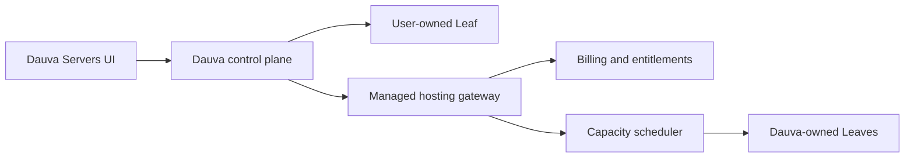

# Managed hosting: separation and economics

Status: planning boundary  
Date: 2026-07-25

## Product decision

The self-hosted Dauva product remains complete without a checkout, rented
machine, region selector, subscription, or hosting account.

If Dauva later sells hosting, it becomes a separate commercial capability that
uses the same Server and Leaf contracts:



The control plane may ask for an eligible Leaf. It must not learn a provider's
VM product IDs, invoice model, payment state, or regional capacity rules.
Those belong behind the managed-hosting gateway.

Do not fork the Seed model or invent a hosting-only runtime. A hosted machine
enrolls as a normal Leaf with extra fleet metadata and policy.

## Why the boundary matters

- Self-hosting can ship and stay useful if hosting never launches.
- Billing outages cannot stop users managing their own Leaves.
- A hosting provider can be replaced without rewriting the creator.
- Hosting liabilities, support promises, tax, refunds, abuse handling, and
  payment data remain outside the core Server model.
- Dauva can test demand before buying a fleet.

## Feasibility gates

Do not sell hosting until all five gates are green:

1. **Runtime:** backup/restore, updates, secrets, logs, safe deletion, port
   allocation, quotas, and Agent auto-update survive failure tests.
2. **Operations:** capacity, alerts, incident runbooks, off-host backups,
   recovery objectives, and a support escalation path exist.
3. **Commercial:** billing, VAT/tax handling, cancellation, refunds, terms,
   abuse response, and data-processing responsibilities are reviewed.
4. **Economics:** a conservative cohort has positive contribution margin after
   compute, storage, backup, bandwidth, payment fees, support, and failure
   reserve.
5. **Demand:** users have paid for a manually fulfilled pilot; survey interest
   alone does not count.

## Staged path

### Stage 0 — self-hosted

Ship Seeds, Leaves, Sprouting, and lifecycle management. Charge nothing for
infrastructure because Dauva supplies none.

### Stage 1 — bring your own host

Offer guided setup for a VM the customer purchases directly. Dauva still does
not resell capacity. This tests onboarding and support load with almost no
inventory risk.

### Stage 2 — concierge pilot

Manually sell a small, clearly limited hosted cohort. Use one provider and a
few fixed shapes. Provision ordinary fleet Leaves behind the gateway. No
automated spot capacity and no annual plans.

Exit criteria:

- at least 20 paying Server-months;
- measured support minutes per active Server-month;
- measured backup storage and egress;
- no unresolved data-loss incident;
- conservative contribution margin at or above 35%;
- cancellation and refund behavior understood.

### Stage 3 — automated hosting

Automate purchase, placement, billing events, quota enforcement, suspension,
and recovery only after the concierge numbers support it.

## Unit economics

Track economics per active Server-month:

```text
revenue net of VAT
- payment processing
- compute allocation
- active storage
- backup storage
- network egress
- observability and control-plane allocation
- support cost
- failure/refund reserve
= contribution margin
```

Use the greater of actual support cost or a minimum support reserve. A low-cost
game Server with one support conversation can otherwise look profitable when
it is not.

Target:

- gross infrastructure margin before support: at least 60%;
- contribution margin after support and reserves: at least 35%;
- no plan priced below a two-times fully loaded infrastructure cost floor;
- monthly plans first, because annual discounts hide uncertainty.

Capacity should be sold from conservative allocatable resources, not headline
machine totals:

```text
allocatable RAM = physical RAM - OS/runtime reserve - failure reserve
allocatable CPU = benchmarked sustained CPU × safe oversubscription policy
```

RAM-heavy dedicated Servers should not subsidize bursty Servers invisibly.
Each shape needs an internal cost weight for RAM, sustained CPU, storage,
backup growth, and public ports.

## First financial experiment

Before writing a billing system:

1. collect a waitlist that asks game, expected players, uptime, region, and
   willingness to pay;
2. offer three fixed monthly shapes to a small invited group;
3. provision them manually as fleet Leaves;
4. record every support minute and infrastructure cost;
5. review the cohort after two billing cycles.

The experiment should be cheap to stop. The self-hosted product and Leaf
protocol remain valuable even if managed hosting does not pass its gates.
